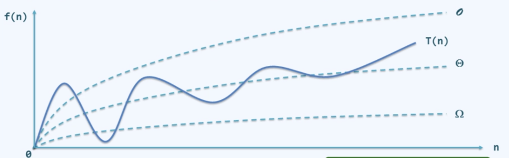

# overview

<!-- @import "[TOC]" {cmd="toc" depthFrom=1 depthTo=6 orderedList=false} -->

<!-- code_chunk_output -->

- [overview](#overview)
    - [概述](#概述)
      - [1.computing](#1computing)
      - [2.度量算法](#2度量算法)
        - [(1) 时间复杂度: T(n)](#1-时间复杂度-tn)
        - [(2) 空间复杂度: S(n)](#2-空间复杂度-sn)
        - [(3) 常见复杂度估算](#3-常见复杂度估算)
      - [3.asymptotic notions](#3asymptotic-notions)
        - [(1) O (big O: order of the function，函数的阶)](#1-o-big-o-order-of-the-function函数的阶)
        - [(2) Ω (big Omega: last letter of greek alphbet)](#2-ω-big-omega-last-letter-of-greek-alphbet)
        - [(3) Θ (theta: middle letter of greek alphbet)](#3-θ-theta-middle-letter-of-greek-alphbet)
        - [(4) o (little o: )](#4-o-little-o-)
        - [(5) ω (little omega: )](#5-ω-little-omega-)
      - [4.常见asymptotic notions](#4常见asymptotic-notions)
      - [5.iteration (迭代) vs recursion (递归)](#5iteration-迭代-vs-recursion-递归)
        - [(1) recursion的复杂度: 递推方法](#1-recursion的复杂度-递推方法)
      - [6.核心策略](#6核心策略)
        - [(1) decrase and conquer (减而治之)](#1-decrase-and-conquer-减而治之)
        - [(2) divide and conquer (分而治之)](#2-divide-and-conquer-分而治之)
        - [(3) transform and conquer (变治法)](#3-transform-and-conquer-变治法)
        - [(4) 递归 时间复杂度较高的情况](#4-递归-时间复杂度较高的情况)
        - [(5) 递归 时间复杂度较低的情况](#5-递归-时间复杂度较低的情况)
      - [7.算法优化思想](#7算法优化思想)
        - [(1) dynamic programming (动态规划)](#1-dynamic-programming-动态规划)
      - [8.average/expected complexity vs amortized complexity](#8averageexpected-complexity-vs-amortized-complexity)
      - [9.二分查找优化](#9二分查找优化)
        - [(1) 低效版](#1-低效版)
        - [(2) 改进版](#2-改进版)

<!-- /code_chunk_output -->

### 概述

#### 1.computing

* computing: data structure + algorithm

#### 2.度量算法

##### (1) 时间复杂度: T(n)

##### (2) 空间复杂度: S(n)

##### (3) 常见复杂度估算

|表达时|复杂度|
|-|-|
|`T(n) = T(n/2) + O(1)`|`O(logn)`|
|`T(n) = T(n/2) + O(n)`|`O(nlog)`|

#### 3.asymptotic notions

##### (1) O (big O: order of the function，函数的阶)
* 最坏情况时间复杂度
* `T(n) = O(f(n))`
    * 表示: 当n >> 2后，`T(n) < c*f(n)`，其中c > 0

* 常系数可以忽略: `O(c*f(n)) = O(f(n))`
* 低次项可以忽略: `O(n^a + n^b) = O(n^a), 其中a > b > 0`

##### (2) Ω (big Omega: last letter of greek alphbet)
* 最好情况时间复杂度
* `T(n) = Ω(f(n))`
    * 表示: 当n >> 2后，`T(n) > c*f(n)`，其中c > 0

##### (3) Θ (theta: middle letter of greek alphbet)

* 一般情况时间复杂度
* `T(n) = Θ(f(n))`
    * 表示: 当n >> 2后，`c1*f(n) > T(n) > c2*f(n)`，其中c1 > c2 >0

##### (4) o (little o: )

##### (5) ω (little omega: )

#### 4.常见asymptotic notions

|类型|表示（以big-O的方式）|容忍程度|
|-|-|-|
|常数|`O(1)`|效率最高|
|对数|`O(log n)`|非常高效，无限接近于常数|
|线性|`O(n)`||
|nlogn|`O(nlog n)`||
|多项式|`O(n^2)`、`O(n^3)`、`n^O(1)`等等|令人满意|
|指数|`2^O(n)`|不可容忍|

#### 5.iteration (迭代) vs recursion (递归)

* iteration就是简单的循环
* recursion就是套娃，将 上一次执行的结果 作为参数 传入该方法，直到满足停止条件
  * 核心: 
    * 思想: 减而治之或分而治之
    * 需要一个**终止条件**
    * 每一次在**上一次返回结果**上进行同样的操作

##### (1) recursion的复杂度: 递推方法
T(n) 求 和T(n-1)的关系
T(n-1) 求 和T(n-2)的关系
以此类推 

#### 6.核心策略

##### (1) decrase and conquer (减而治之)
将一个问题**简化**成为**规模更小**的问题
* 比如求和: 将F(n)简化成F(n-1) + 最后一个常数，然后进行迭代

##### (2) divide and conquer (分而治之)
将一个复杂问题**分解**为**多个简单**的问题
* 比如求和: 将F(n)简化成F(n/2 - 1)和F(n/2 , n)，然后进行迭代

##### (3) transform and conquer (变治法)
将一个问题**转变**成**更易解决**的问题

##### (4) 递归 时间复杂度较高的情况

* 原因:
  * 因为递归会有很多重复的步骤

* 解决方法:
  * 使用迭代和动态规划

##### (5) 递归 时间复杂度较低的情况

* 原因:
  * 比如想象成二叉树，对比的次数 << 依次比较的次数

#### 7.算法优化思想

##### (1) dynamic programming (动态规划)

* 优化目标: 递归
* 基本思想:
  * 将大问题分解为小问题
  * 存储子问题结果，避免重复计算

#### 8.average/expected complexity vs amortized complexity

比如: 计算数组扩容的复杂度

* average/expected complexity
  * 就是计算一次扩容到n所需要的复杂度
* amortized complexity
  * 就是计算从一个很小的数，扩容到n所需的复杂度的平均

#### 9.二分查找优化
* 需要查找的元素: e
* 中间值: mid

##### (1) 低效版
* 说明:
  * 先比较: `if e < mid`
  * 再比较: `if e == mid`
  * 否则在左边寻找
* 性能不是最优化:
  * 查找右边只需要一次比较，查找左边需要两边比较
  * 最好情况和最坏情况，差距比较大

##### (2) 改进版

* 说明:
  * 先比较: `if e < mid`
  * 否则在左边寻找
* 性能是优的:
  * 查找左边和右边都只需要一次比较
  * 最好情况和最坏情况相对稳定