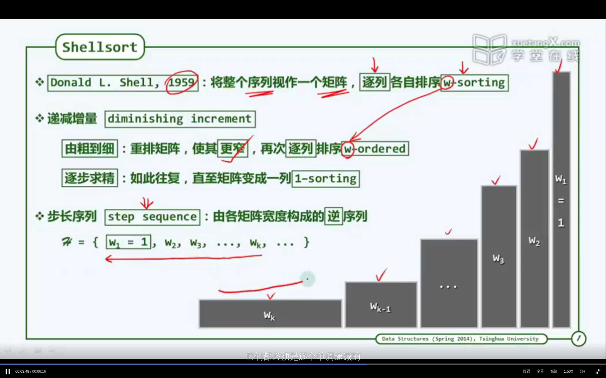
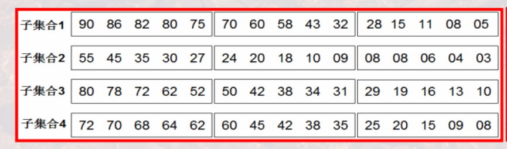
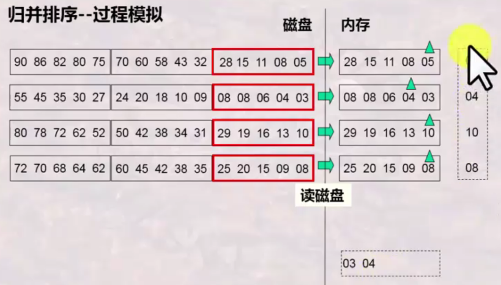
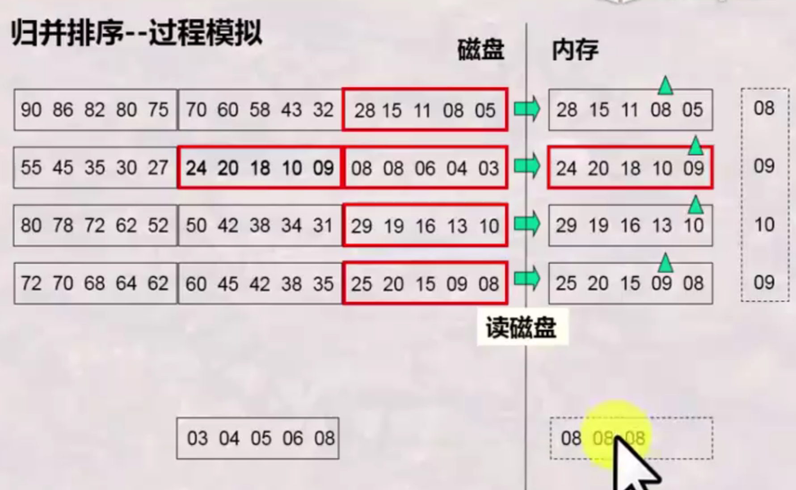

# sort 

<!-- @import "[TOC]" {cmd="toc" depthFrom=1 depthTo=6 orderedList=false} -->

<!-- code_chunk_output -->

- [sort](#sort)
    - [概述](#概述)
      - [1.quick sort (快排序)](#1quick-sort-快排序)
        - [(1) pivot (轴点)](#1-pivot-轴点)
        - [(2) partition算法 (分区算法)](#2-partition算法-分区算法)
        - [(3) 性能分析](#3-性能分析)
        - [(4) quick select (解决selection问题)](#4-quick-select-解决selection问题)
      - [2.linear select (对quick select的优化)](#2linear-select-对quick-select的优化)
        - [(1) 算法](#1-算法)
        - [(2) 性能分析](#2-性能分析)
      - [3.shell排序框架 (希尔排序框架)](#3shell排序框架-希尔排序框架)
        - [(1) diminishing increment (递减增量)](#1-diminishing-increment-递减增量)
        - [(2) step sequence (步长序列)](#2-step-sequence-步长序列)
        - [(3) 算法](#3-算法)
      - [4.internal sort and external sort](#4internal-sort-and-external-sort)
        - [(1) 内排序](#1-内排序)
        - [(2) 外排序](#2-外排序)
    - [external  sort](#external--sort)
      - [1.external merge sort (polyphase merge sort)](#1external-merge-sort-polyphase-merge-sort)
        - [(1) 算法概述](#1-算法概述)
        - [(2) 以two-phase为例](#2-以two-phase为例)

<!-- /code_chunk_output -->

### 概述

#### 1.quick sort (快排序)

快排序: 选取pivot，然后迭代使用partition算法

* 不稳定: 相同的元素，位置可能会颠倒

##### (1) pivot (轴点)
* 左侧元素 <= pivot
* 右侧元素 >= pivot

##### (2) partition算法 (分区算法)
* 选择第一个节点为预备pivot
* 从前和从后遍历，逐渐将预备pivot移动到正确的位置

##### (3) 性能分析
* pivot的选取，会影响排序的性能
    * 最坏情况 (选取pivot，不能使用序列划分均衡): O(n^2)
    * 最好情况 (选取pivot，能使用序列划分均衡): O(nlogn)

##### (4) quick select (解决selection问题)

* selection问题
    * 找出排序后的第k个元素
* 使用partition算法

#### 2.linear select (对quick select的优化)

##### (1) 算法

* 选取一个常数Q
* 将序列分为 n/Q 个子序列
* 对每个子序列进行排序
* 找出每个子序列的中位数m，找出这些中位数中的中位数M
* 遍历所有元素，分别放入三个子序列中
    * L中的元素 < M
    * E中的元素 = M
    * G中的元素 > M
* 如果第k个元素在L或G中，则针对L或G进行上述递归

##### (2) 性能分析

当Q=5时，时间复杂度最好: O(n)，但是常系数比较大
* 所以这种算法更具理论意义

#### 3.shell排序框架 (希尔排序框架)

##### (1) diminishing increment (递减增量)
矩阵宽度越来越小，最后变为宽度为1，即就是一列

##### (2) step sequence (步长序列)
S = {W1=1,W2,W3, ... ,Wk, ...}
每一次矩阵的宽度在上述序列中，按逆序选择
所需步长序列的选择，决定了排序的性能

##### (3) 算法

* 将一个序列，转换成一个宽度为Wk的矩阵
    * 注意转换并不是真实转换，而是逻辑上这样处理:
        * 第一列: T[0], T[Wk], ...
        * 第二列: T[1], T[1+Wk], ...
* 对每一列进行插入排序
* 然后再转换成一个宽度为Wk-1的矩阵
* 对每一列进行插入排序
* 迭代，最后转成为1列，然后进行插入排序

#### 4.internal sort and external sort

##### (1) 内排序
将所有数据加载到内存中进行排序，前面所介绍的排序算法（QuickSort, Merge Sort, HeapSort等）都是内排序算法

##### (2) 外排序
用于处理大数据的排序问题，因为无法将数据全部加载进内存，常用的排序算法就是external merge sort (aka polyphase sort)

***

### external  sort

#### 1.external merge sort (polyphase merge sort)

##### (1) 算法概述

* phase 1:
  * 将数据集划分为多个子集（子集能够装入内存）
  * 将每个子集进行排序
* phase 2:
  * 将子集进行合并
    * 选择所有子集的第一个元素加载到内存（如果内存不够，就要**更多phase**，每个phase合并有限量的子集）
    * 比较所有子集的第一个元素，选出最小/最大的元素，放入到output中，然后在子集中指针移动到下一个元素
    * 重复上述的步骤
* phase N:
  * 如果内存不够，无法在一个phase中合并所有子集，就要**更多phase**，每个phase合并有限量的子集

##### (2) 以two-phase为例

* 假设:
  * 一个数据块能存储5个元素
  * 内存有6块（页）
  * 待排序的数据有60个元素，则需要12块

* phase 1:
  * 划分子集，并进行子集排序
    * 待排序数据的块数 / 子集数 < 内存块数
      * 如果子集数 > 内存块数，则需要多次phase
      * 所以划分4为个子集，只需要两次phase
  

* phase 2:
  * 归并阶段
  
  
  * 子集2中的第一块处理完了，则将第一块踢出内存，将第二块加载到内存中
  * 输出结果的第一块写完了，则存到外存中
  * 依照上图进行类推，从而完成合并

* two-phase的算法复杂性（假设一次I/O只读一个数据块），则需要的I/O数：
  * 考虑最终结果的写回
    * 4 * 待排序的数据的块数 = 4*12=48
      * 子集合排序阶段读一遍写一遍 2 * 待排序的数据的块数
      * 合并阶段读一遍写一遍 2 * 待排序的数据的块数
