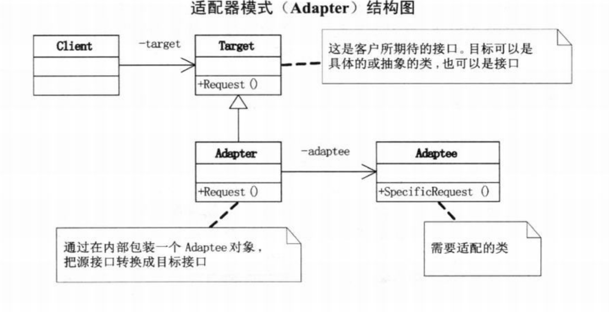
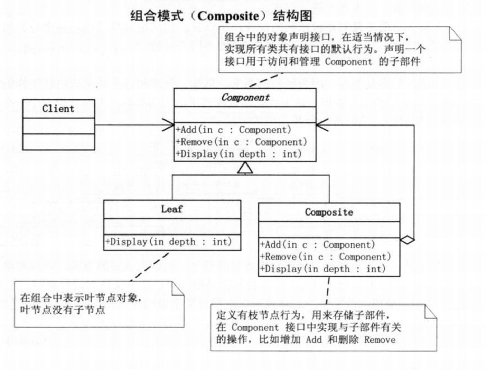
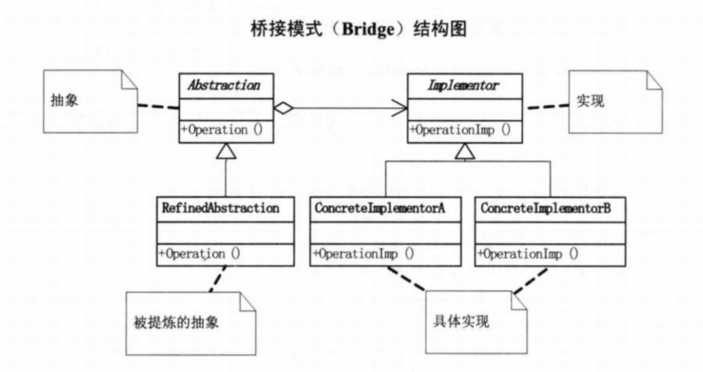
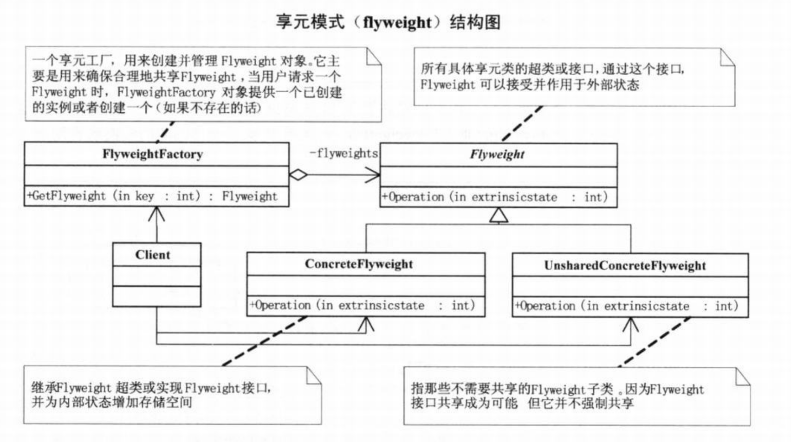
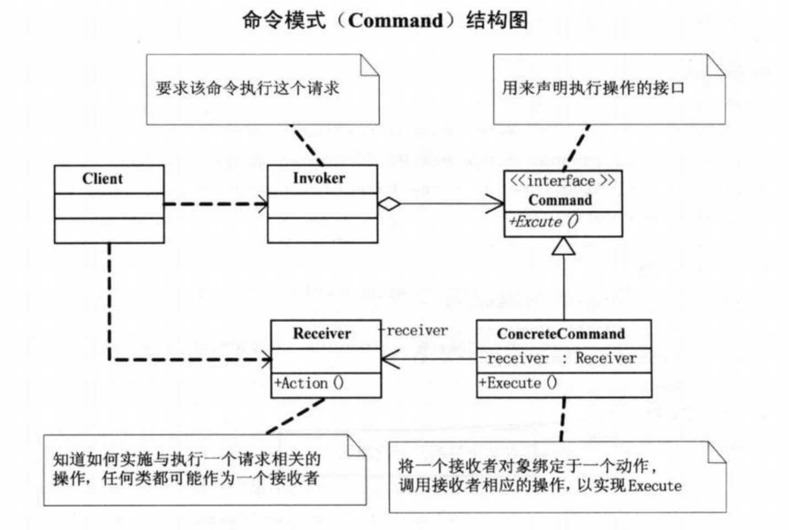
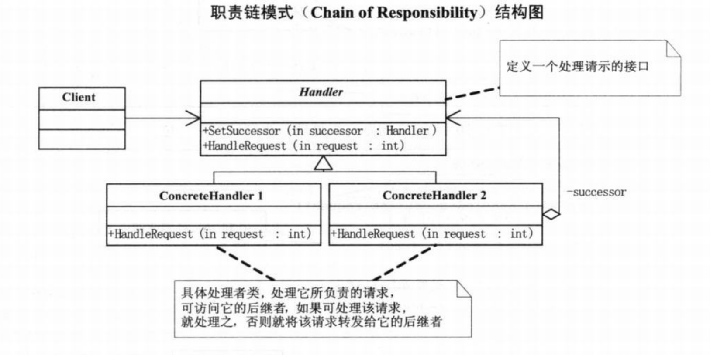
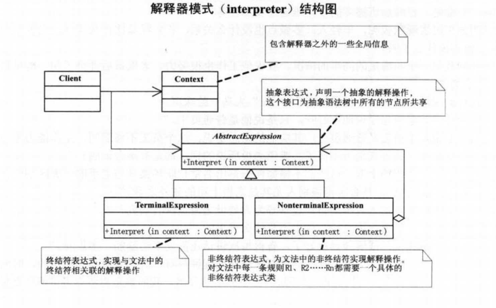
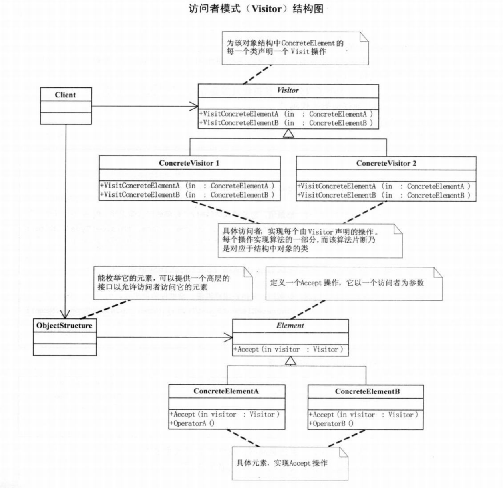

# overview


<!-- @import "[TOC]" {cmd="toc" depthFrom=1 depthTo=6 orderedList=false} -->

<!-- code_chunk_output -->

- [overview](#overview)
    - [概述](#概述)
      - [1.设计原则概述](#1设计原则概述)
        - [(1) 目标](#1-目标)
        - [(2) 思路](#2-思路)
        - [(3) 以计算器为例](#3-以计算器为例)
      - [2.设计原则（S.O.L.I.D.）](#2设计原则solid)
        - [(1) DIP详细说明](#1-dip详细说明)
      - [3.对象的四种关系](#3对象的四种关系)
    - [创建型设计模式](#创建型设计模式)
      - [1.factory](#1factory)
        - [(1) simple factory](#1-simple-factory)
        - [(2) factory method](#2-factory-method)
        - [(3) abstract factory](#3-abstract-factory)
      - [2.builder (建造者模式，也叫生成器模式 creational)](#2builder-建造者模式也叫生成器模式-creational)
        - [(1) 说明](#1-说明)
        - [(2) 适用场景](#2-适用场景)
      - [3.prototype（原型模式）](#3prototype原型模式)
        - [(1) 说明](#1-说明-1)
        - [(2) 适用场景](#2-适用场景-1)
      - [4.singleton（单例模式）](#4singleton单例模式)
        - [(1) 说明](#1-说明-2)
        - [(2) 示例](#2-示例)
    - [结构型设计模式](#结构型设计模式)
      - [1.decorator](#1decorator)
        - [(1) 说明](#1-说明-3)
        - [(2) 适用场景](#2-适用场景-2)
      - [2.adapter（适配器，也就是转接头）](#2adapter适配器也就是转接头)
        - [(1) 说明](#1-说明-4)
        - [(2) 适用场景](#2-适用场景-3)
      - [3.facade（外观模式）](#3facade外观模式)
        - [(1) 说明](#1-说明-5)
        - [(2) 适用场景](#2-适用场景-4)
      - [4.proxy](#4proxy)
        - [(1) 说明](#1-说明-6)
        - [(2) 适用场景](#2-适用场景-5)
        - [(3) proxy、facade区别](#3-proxy-facade区别)
      - [5.composite（组合模式）](#5composite组合模式)
        - [(1) 说明](#1-说明-7)
        - [(2) 适用场景](#2-适用场景-6)
      - [6.bridge（桥接模式）](#6bridge桥接模式)
        - [(1) 说明](#1-说明-8)
        - [(2) 适用场景](#2-适用场景-7)
      - [7.flyweight（享元模式）](#7flyweight享元模式)
        - [(1) 说明](#1-说明-9)
        - [(2) 适用场景](#2-适用场景-8)
    - [行为型设计模式](#行为型设计模式)
      - [1.strategy](#1strategy)
        - [(1) 说明](#1-说明-10)
        - [(2) 适用场景](#2-适用场景-9)
      - [2.template method（模板方法模式）](#2template-method模板方法模式)
        - [(1) 说明](#1-说明-11)
        - [(2) 示例](#2-示例-1)
      - [3.observer（观察者模式，也叫发布订阅模式）](#3observer观察者模式也叫发布订阅模式)
        - [(1) 说明](#1-说明-12)
      - [4.iterator（迭代器模式）](#4iterator迭代器模式)
      - [5.state (状态模式)](#5state-状态模式)
        - [(1) 说明](#1-说明-13)
        - [(2) 适用场景](#2-适用场景-10)
      - [6.memento（备忘录模式）](#6memento备忘录模式)
        - [(1) 说明](#1-说明-14)
        - [(2) 适用场景](#2-适用场景-11)
      - [7.command（命令模式）](#7command命令模式)
        - [(1) 说明](#1-说明-15)
        - [(2) 适用场景](#2-适用场景-12)
      - [8.chain of responsibility](#8chain-of-responsibility)
        - [(1) 说明](#1-说明-16)
        - [(2) 适用场景](#2-适用场景-13)
      - [9.mediator（中介者模式，调停者模式）](#9mediator中介者模式调停者模式)
        - [(1) 说明](#1-说明-17)
        - [(2) 适用场景](#2-适用场景-14)
        - [(3) mediator vs observer](#3-mediator-vs-observer)
      - [10.interpret（解释器模式）](#10interpret解释器模式)
        - [(1) 说明](#1-说明-18)
        - [(2) 适用场景](#2-适用场景-15)
      - [11.vistor（访问者模式）](#11vistor访问者模式)
        - [(1) 说明](#1-说明-19)
        - [(2) 适用场景](#2-适用场景-16)

<!-- /code_chunk_output -->

### 概述

#### 1.设计原则概述

##### (1) 目标
* 可维护
* 可复用
* 可扩展
* 灵活性好

##### (2) 思路
通过封装、继承、多态 **降低耦合度**


##### (3) 以计算器为例
* 创建一个运算类
    * 加、减等都继承该运算类
* 创建一个工厂类
    * 根据参数，返回相应的运算类

#### 2.设计原则（S.O.L.I.D.）

|原则 (S.O.L.I.D.)|说明|好处|
|-|-|-|
|SRP: single responsibility principle|单一职责|便于维护、复用，灵活性更好|
|OCP: open-close principle|对扩展开放，对修改封闭|有新的变化，只需要进行添加，而无须修改（比如计算器，抽样出一个运算类，有新的运算直接扩展就行了，无需修改）|
|LSP: liskov substitution principle|子类型必须能够替换掉他们的父类型（即当声明的类型是 父类，可以传入 子类实例）|是DIP、OCP的基础|
|ISP: interface segregation principle|接口应该小而完备（减少依赖性）|
|**DIP**: dependency inversion principle|高层模块不应该依赖低层模块，两者都应该**依赖抽象**（即接口或抽象类）</br>抽象不应该依赖细节，细节应该依赖抽象|是面向对象的标志|
|CARP: composition/aggregation reuse principle|组合/聚合 复用原则，优先使用对象组合或聚合|

##### (1) DIP详细说明
* 为什么叫依赖倒置
    * 以前是高层依赖低层，倒置后，两者都依赖抽象
* 举例: 有一个Copier class，需要从keyboard读取输入，打印到printer
    * 高层依赖低层的设计模式
    
        * 代码
            ```java
            public class Copier{
                private readonly Keyboard _keyboard;
                private readonly Printer _printer;

                public Copier(Keyboard keyboard, Printer printer){
                    _keyboard = keyboard;
                    _printer = printer;
                }


                public void Copy(){
                    int c = _keyboard.Read();
                    while(!_keyboard.IsEndingCharacter(c)){
                        _printer.Write(c);
                        c = _keyboard.Read();
                    }
                }
            }
            ```
    * 都依赖抽象
    
        * 代码
            ```java
            public class Copier{
                private readonly IReader _reader;
                private readonly IWriter _writer;

                public Copier(IReader reader, IWriter writer){
                    _reader = reader;
                    _writer = writer;
                }


                public void Copy(){
                    int c = _reader.Read();
                    while(!_reader.IsEndingCharacter(c)){
                        _writer.Write(c);
                        c = _reader.Read();
                    }
                }
            } 
            ```

#### 3.对象的四种关系

|对象关系|说明|
|-|-|
|dependcy|依赖关系，一个类的实现依赖另一个类的定义|
|association|关联关系，一个类的属性或方法与另一个类有关系|
|aggregation|较强的关联关系，整体与个体的关系，即整体可以没有这个个体|
|composition|更强的关系关系，整体与部分的关系，即整体不能没有这个部分|

***

### 创建型设计模式

#### 1.factory

##### (1) simple factory
* 提供一个用于 创建对象 的接口，由工厂类决定实例化哪一个类
    * 需要增加一个类时，需要修改工厂类，违背了OCP原则


##### (2) factory method
* 提供一个用于 创建对象 的接口，由子类决定实例化哪一个类
    * 需要增加一个类时，只需要继承工厂类进行扩展
    * factory method就是一个方法


##### (3) abstract factory
* 提供一个用于 创建一系列相关对象 的接口，由子类决定实例化哪些类
    * abstract factory是一个对象，有多个factory method


#### 2.builder (建造者模式，也叫生成器模式 creational)

##### (1) 说明
* 将一个复杂对象的 构建 和 表示 分离，使得 同样的构建过程 可以创建 不同的表示


##### (2) 适用场景
* 用于创建一些复杂的对象：
    * 对象内部构建间的 顺序通常是稳定的
    * 具体的内部构建内容是变化的

#### 3.prototype（原型模式）

##### (1) 说明
* 提供一个clone方法（有浅复制和深复制），能够赋值该类

##### (2) 适用场景
* 比如：商品类，首先定一个原先，如果需要打折，则可以复制该商品实例，然后设置打折的参数（就无需重新实例化）

#### 4.singleton（单例模式）

##### (1) 说明
* 只实例化一次

##### (2) 示例

```python
#注意：每执行一次实例化，new函数和init函数都会执行一次
class A:
    #该静态变量，用于指向创建的实例
    __instance = None

    #该静态变量，用于表示init函数是否执行过，防止重复执行
    __init_flag = False


    def __new__(cls, *args, **kwargs):
        if not cls.__instance:
            cls.__instance = super().__new__(cls)
        return cls.__instance

    def __init__(self):
        if not A.__init_flag:
            A.__init_flag = True
            pass

a1 = A()
a2 = A()

#id(a1) == id(a2)
```

***

### 结构型设计模式

#### 1.decorator

##### (1) 说明
* 是为了添加更多 通用功能 的方式
* 把类的 核心职责 和 装饰功能（某种特定情况下才需要的功能） 区分

##### (2) 适用场景
* 当需要添加通用功能（不是针对某一个类）

#### 2.adapter（适配器，也就是转接头）

##### (1) 说明
* 将一个类的接口转换成另一个接口


##### (2) 适用场景
* 想使用一个已存在的类，但它的接口不符合你的要求，则应该考虑适配器模式
* 比如：数据库适配器，针对不同的数据库提供统一的接口，这样当数据库切换时，就不需要修改代码了

#### 3.facade（外观模式）

##### (1) 说明
* 为一组对象或接口 提供一个简单的的对外的接口

##### (2) 适用场景
* 比如：有一个遗留的就系统比较复杂，任何修改都会引发问题，为了扩展会开发一个新系统，然后使用外观模式，将旧系统封装，给新系统使用

#### 4.proxy

##### (1) 说明
* 为对象的访问提供一种代理 以控制对这个对象的访问

##### (2) 适用场景
* 远程代理
    * 为一个对象在 不同的地址空间中 提供一个局部代表（这样使用者就感觉对象跟它在一个地址空间中）
* 虚拟代理
    * 代理实例化需要很长时间的对象，当未实例好时，返回一些假的内容来代替真实内容（比如浏览器： 当打开一个网页时，需要很长时间，浏览器会先将文字展示出来，图片一张一张显示）
* 安全代理
    * 访问对象时进行一些写安全控制
* 智能指引
    * 调用对象时，添加一些额外的功能

##### (3) proxy、facade区别
* 方式相同（都是封装），目的不一样

|模式|目的|
|-|-|
|proxy|代表一个单一对象： 用于控制对其他对象的访问|
|facade|代表一个子系统： 封装多个类的关联，对外提供一个简单的接口|

#### 5.composite（组合模式）

##### (1) 说明
* 将 对象 组合成树形结构，对 单个对象 和 组合对象的使用 具有一致性


##### (2) 适用场景
* 只要是树形结构，就需要考虑组合模式

#### 6.bridge（桥接模式）

##### (1) 说明
* 将 抽象部分 和 实现部分 分离
    * 即当有**多个方向的变化**时，那把每种角度分离出来，然后进行桥接（即组合或者聚合）
        * 比如以前的手机有两种角度：手机品牌和手机软件，则将手机品牌和手机软件分离



##### (2) 适用场景
* 当有多角度分类，每一种分类都可能有变化，那把每种角度分离出来


#### 7.flyweight（享元模式）

##### (1) 说明
* 运用共享技术有效支持大量细粒度的对象
    * 内部状态： 不能改变，可以共享的
    * 外部状态： 可以改变，不能共享的



##### (2) 适用场景
* 如果一个应用程序使用了大量的对象且有共享属性（即内部状态），而大量的这些对象造成了很大的存储开销时就应该考虑

***

### 行为型设计模式

#### 1.strategy

##### (1) 说明
* 分别封装算法，让他们之间可以相互替换，对使用算法的用户是透明的


##### (2) 适用场景
* 当算法不固定，且能够相互替换

#### 2.template method（模板方法模式）

##### (1) 说明
* 定义一个操作的算法的骨架，将一些步骤延迟到子类中

##### (2) 示例
```python
class A:
    def step1(self):
        pass
    def step2(self):
        pass
    def step3(self):
        pass
    def step4(self):
        pass
    def step5(self):
        pass

    def run():
        self.step1()
        self.step2()
        self.step3()
        self.step4()
        self.step5()

class B:
    def step2(self):
        pass
    def step4(self):
        pass


b = B()
b.run()
```

#### 3.observer（观察者模式，也叫发布订阅模式）

##### (1) 说明
* 定义对象的一对多的依赖关系，当一个对象的状态发生改变时，所有依赖它的对象都会得到通知并进行更新操作

#### 4.iterator（迭代器模式）

不需要实现了，高级语言已经把这个模式做在语言中了

#### 5.state (状态模式)

##### (1) 说明
* 当一个对象的内在状态改变时允许改变其行为
* 提供了一个更好的方法来 组织与特定状态相关的代码


##### (2) 适用场景
* 当条件分支稳定，基本不会变时，不应该使用该模式
* 当一个对象状态转换的条件表达式过于复杂时
    * 把状态的判断逻辑 转移到 表示不同状态的一系列类当中，可以简化逻辑

#### 6.memento（备忘录模式）

##### (1) 说明
* 在不破坏封装性的前提下，捕获一个对象的内部状态，并在 对象之外 保存这个状态
    * 并对其他对象屏蔽 需保存对象的 内部信息


##### (2) 适用场景
* 功能比较复杂，但需要维护或记录属性历史
* 需要保存的属性只是一小部分（如果要保存大部分，可以考虑使用clone方式）

#### 7.command（命令模式）

##### (1) 说明
* 将一个请求封装为一个对象，从而能够使用不同的请求，将客户端进行参数化（即客户端只要传入参数，调用请求就行了）
    * 能够对请求进行记录、排队、撤销等
* 将 调用操作的对象 和 实现该操作的对象 解耦



##### (2) 适用场景
只要认为是命令的地方就可以考虑使用命令模式

#### 8.chain of responsibility

##### (1) 说明
* 将对象连成一条链，并沿着这条链传递该请求，直到有一个对象处理为止


##### (2) 适用场景
* 适合一个请求需要在多个对象中传递，直到有一个对象能处理为止

#### 9.mediator（中介者模式，调停者模式）

##### (1) 说明
* 用一个中介对象来封装一系列的对象交互
    * 从而使各对象松耦合，都通过中介者进行通信
* 缺点
    * 中介者过于复杂

##### (2) 适用场景
* 与观察者模式类似，但是相互通信的

##### (3) mediator vs observer
* observer
    * 一对多，单向通信
* mediator
    * 通过中介者相互通信

#### 10.interpret（解释器模式）

##### (1) 说明
* 按照规定语法进行解析的方案（现在使用较少）
    * 终结符： 除了需要赋值，不需要做任何处理
    * 非终结符： 需要做相应处理操作



##### (2) 适用场景
* 如果一种特定类型的问题发生的频率足够高时
* 使用非常少

#### 11.vistor（访问者模式）

##### (1) 说明
* 当一个对象中的各个元素是不变的，可以在不改变各元素的类的前提下，为这些元素 定义 作用于这些元素的新操作
    * 将 数据结构 和 作用于结构上的操作 解耦了，使得操作可以自由扩展



##### (2) 适用场景
* 适用于数据结构稳定的系统，因为增加新的数据结构，变动就会比较大，不满足OCP原则
