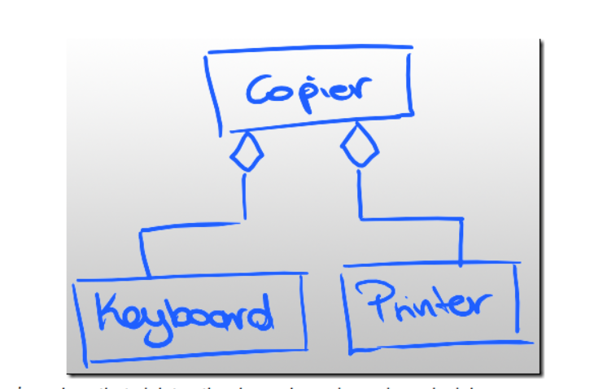
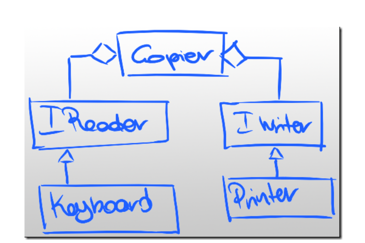
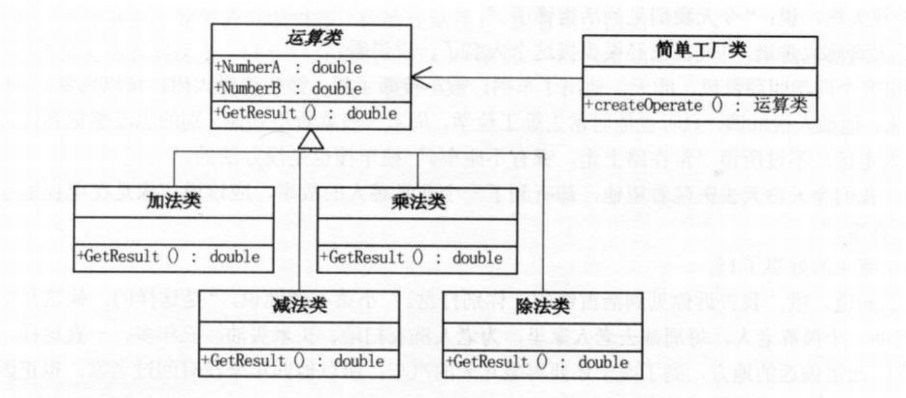
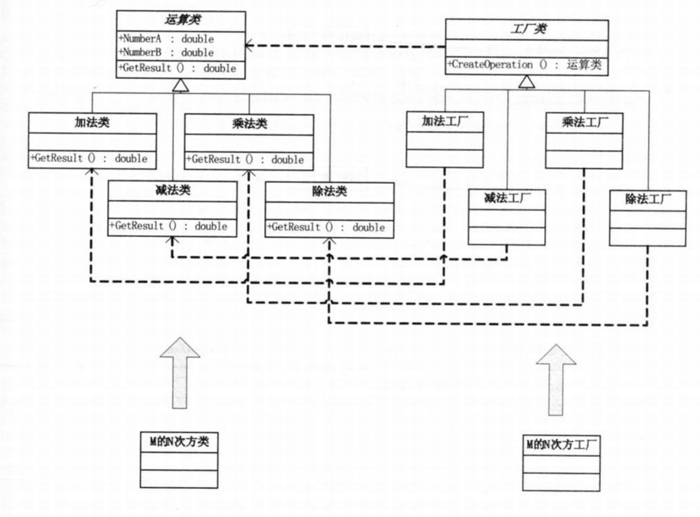
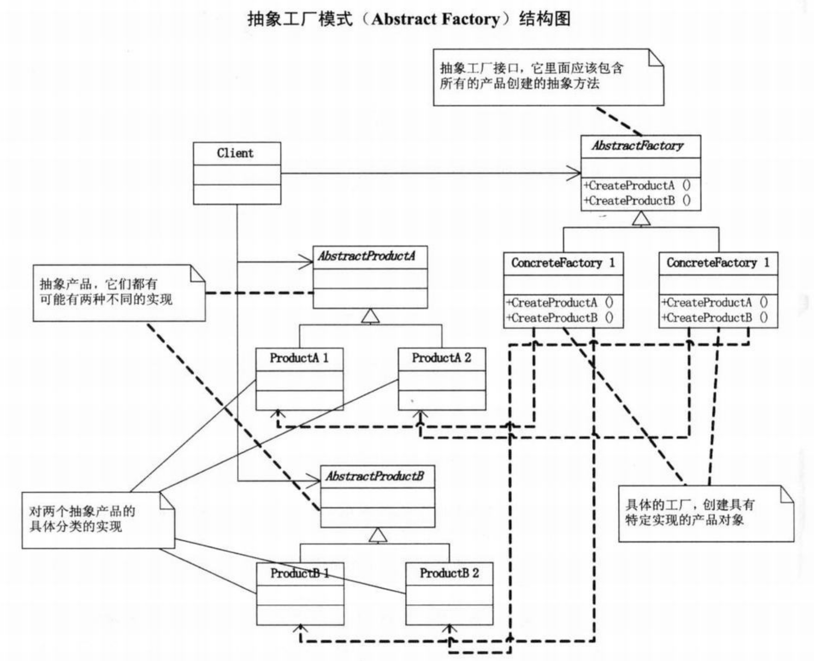
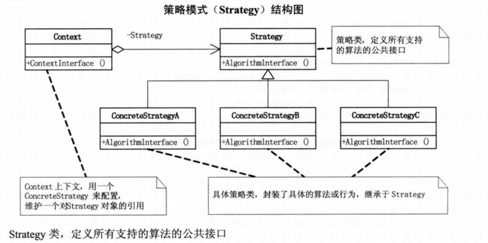
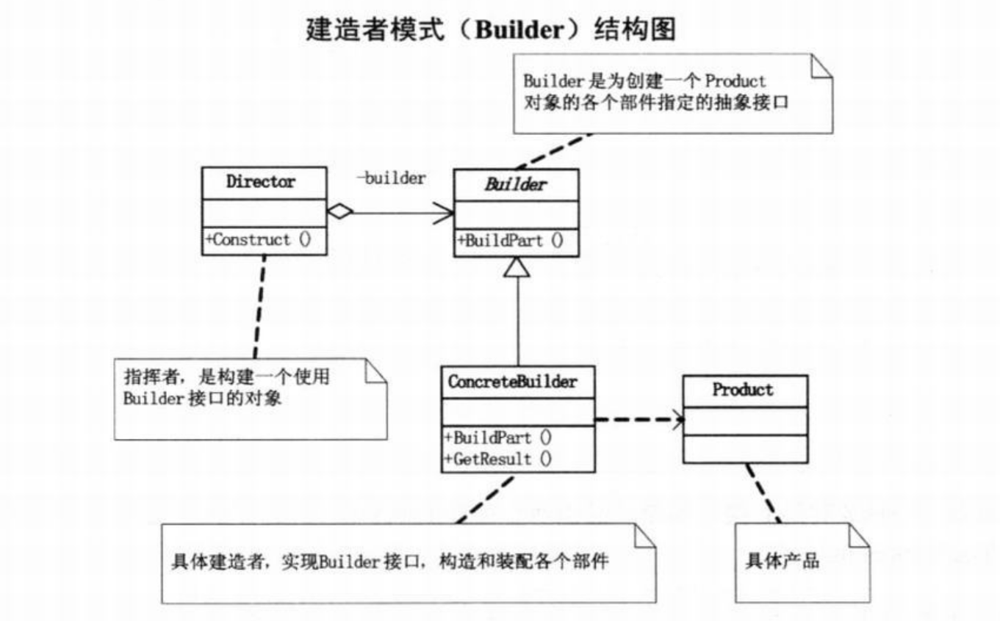
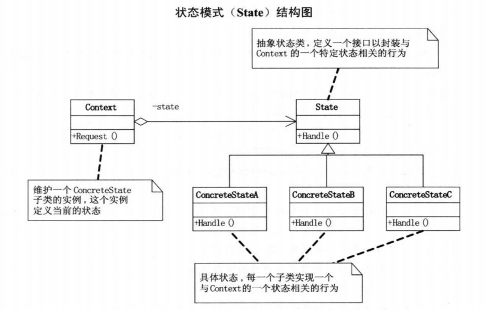

# overview


<!-- @import "[TOC]" {cmd="toc" depthFrom=1 depthTo=6 orderedList=false} -->

<!-- code_chunk_output -->

- [overview](#overview)
    - [概述](#概述)
      - [1.设计原则概述](#1设计原则概述)
        - [(1) 目标](#1-目标)
        - [(2) 思路](#2-思路)
        - [(3) 以计算器为例](#3-以计算器为例)
      - [2.设计原则（S.O.L.I.D.）](#2设计原则solid)
        - [(1) DIP详细说明](#1-dip详细说明)
      - [3.对象的四种关系](#3对象的四种关系)
    - [设计模式](#设计模式)
      - [1.factory](#1factory)
        - [(1) simple factory](#1-simple-factory)
        - [(2) factory method](#2-factory-method)
        - [(3) abstract factory](#3-abstract-factory)
      - [2.strategy](#2strategy)
        - [(1) 说明](#1-说明)
        - [(2) 适用场景](#2-适用场景)
      - [3.decorator](#3decorator)
        - [(1) 说明](#1-说明-1)
        - [(2) 适用场景](#2-适用场景-1)
      - [4.proxy](#4proxy)
        - [(1) 说明](#1-说明-2)
        - [(2) 适用场景](#2-适用场景-2)
        - [(3) proxy、facade区别](#3-proxy-facade区别)
      - [5.builder (建造者模式，也叫生成器模式 creational)](#5builder-建造者模式也叫生成器模式-creational)
        - [(1) 说明](#1-说明-3)
        - [(2) 适用场景](#2-适用场景-3)
      - [6.state (状态模式)](#6state-状态模式)
        - [(1) 说明](#1-说明-4)
        - [(2) 适用场景](#2-适用场景-4)
      - [5.其他模式](#5其他模式)

<!-- /code_chunk_output -->

### 概述

#### 1.设计原则概述

##### (1) 目标
* 可维护
* 可复用
* 可扩展
* 灵活性好

##### (2) 思路
通过封装、继承、多态 **降低耦合度**


##### (3) 以计算器为例
* 创建一个运算类
    * 加、减等都继承该运算类
* 创建一个工厂类
    * 根据参数，返回相应的运算类

#### 2.设计原则（S.O.L.I.D.）

|原则 (S.O.L.I.D.)|说明|好处|
|-|-|-|
|SRP: single responsibility principle|单一职责|便于维护、复用，灵活性更好|
|OCP: open-close principle|对扩展开放，对修改封闭|有新的变化，只需要进行添加，而无须修改（比如计算器，抽样出一个运算类，有新的运算直接扩展就行了，无需修改）|
|LSP: liskov substitution principle|子类型必须能够替换掉他们的父类型（即当声明的类型是 父类，可以传入 子类实例）|是DIP、OCP的基础|
|ISP: interface segregation principle|接口应该小而完备（减少依赖性）|
|**DIP**: dependency inversion principle|高层模块不应该依赖低层模块，两者都应该**依赖抽象**（即接口或抽象类）</br>抽象不应该依赖细节，细节应该依赖抽象|是面向对象的标志|

##### (1) DIP详细说明
* 为什么叫依赖倒置
    * 以前是高层依赖低层，倒置后，两者都依赖抽象
* 举例: 有一个Copier class，需要从keyboard读取输入，打印到printer
    * 高层依赖低层的设计模式
    
        * 代码
            ```java
            public class Copier{
                private readonly Keyboard _keyboard;
                private readonly Printer _printer;

                public Copier(Keyboard keyboard, Printer printer){
                    _keyboard = keyboard;
                    _printer = printer;
                }


                public void Copy(){
                    int c = _keyboard.Read();
                    while(!_keyboard.IsEndingCharacter(c)){
                        _printer.Write(c);
                        c = _keyboard.Read();
                    }
                }
            }
            ```
    * 都依赖抽象
    
        * 代码
            ```java
            public class Copier{
                private readonly IReader _reader;
                private readonly IWriter _writer;

                public Copier(IReader reader, IWriter writer){
                    _reader = reader;
                    _writer = writer;
                }


                public void Copy(){
                    int c = _reader.Read();
                    while(!_reader.IsEndingCharacter(c)){
                        _writer.Write(c);
                        c = _reader.Read();
                    }
                }
            } 
            ```

#### 3.对象的四种关系

|对象关系|说明|
|-|-|
|dependcy|依赖关系，一个类的实现依赖另一个类的定义|
|association|关联关系，一个类的属性或方法与另一个类有关系|
|aggregation|较强的关联关系，整体与个体的关系，即整体可以没有这个个体|
|composition|更强的关系关系，整体与部分的关系，即整体不能没有这个部分|

***

### 设计模式

#### 1.factory

##### (1) simple factory
* 提供一个用于 创建对象 的接口，由工厂类决定实例化哪一个类
    * 需要增加一个类时，需要修改工厂类，违背了OCP原则



##### (2) factory method
* 提供一个用于 创建对象 的接口，由子类决定实例化哪一个类
    * 需要增加一个类时，只需要继承工厂类进行扩展
    * factory method就是一个方法



##### (3) abstract factory
* 提供一个用于 创建一系列相关对象 的接口，由子类决定实例化哪些类
    * abstract factory是一个对象，有多个factory method



#### 2.strategy

##### (1) 说明
* 分别封装算法，让他们之间可以相互替换，对使用算法的用户是透明的


##### (2) 适用场景
* 当算法不固定，且能够相互替换

#### 3.decorator

##### (1) 说明
* 是为了添加更多 通用功能 的方式
* 把类的 核心职责 和 装饰功能（某种特定情况下才需要的功能） 区分

##### (2) 适用场景
* 当需要添加通用功能（不是针对某一个类）

#### 4.proxy

##### (1) 说明
* 为对象的访问提供一种代理 以控制对这个对象的访问

##### (2) 适用场景
* 远程代理
    * 为一个对象在 不同的地址空间中 提供一个局部代表（这样使用者就感觉对象跟它在一个地址空间中）
* 虚拟代理
    * 代理实例化需要很长时间的对象，当未实例好时，返回一些假的内容来代替真实内容（比如浏览器： 当打开一个网页时，需要很长时间，浏览器会先将文字展示出来，图片一张一张显示）
* 安全代理
    * 访问对象时进行一些写安全控制
* 智能指引
    * 调用对象时，添加一些额外的功能

##### (3) proxy、facade区别
* 方式相同（都是封装），目的不一样

|模式|目的|
|-|-|
|proxy|用于控制对其他对象的访问|
|facade|封装多个类的关联，对外提供一个简单的接口|

#### 5.builder (建造者模式，也叫生成器模式 creational)

##### (1) 说明
* 将一个复杂对象的 构建 和 表示 分离，使得 同样的构建过程 可以创建 不同的表示


##### (2) 适用场景
* 用于创建一些复杂的对象：
    * 对象内部构建间的 顺序通常是稳定的
    * 具体的内部构建内容是变化的

#### 6.state (状态模式)

##### (1) 说明
* 当一个对象的内在状态改变时允许改变其行为


##### (2) 适用场景
* 当一个对象状态转换的条件表达式过于复杂时
    * 把状态的判断逻辑 转移到 表示不同状态的一系列类当中，可以简化逻辑

#### 5.其他模式

|模式|说明|适用场景|
|-|-|-|
|prototype|原型模式，提供一个clone方法（有浅复制和深复制），能够赋值该类|比如：商品类，首先定一个原先，如果需要打折，则可以复制该商品实例，然后设置打折的参数（就无需重新实例化）|
|template method|模板方法模式，定义一个操作的算法的骨架，将一些步骤延迟到子类中|比较常见|
|facade|外观模式，为一组对象或接口 提供一个简单的的对外的接口|比如：有一个遗留的就系统比较复杂，任何修改都会引发问题，为了扩展会开发一个新系统，然后使用外观模式，将旧系统封装，给新系统使用|
|observer|观察者模式，也叫发布订阅模式（public/subscibe）||

