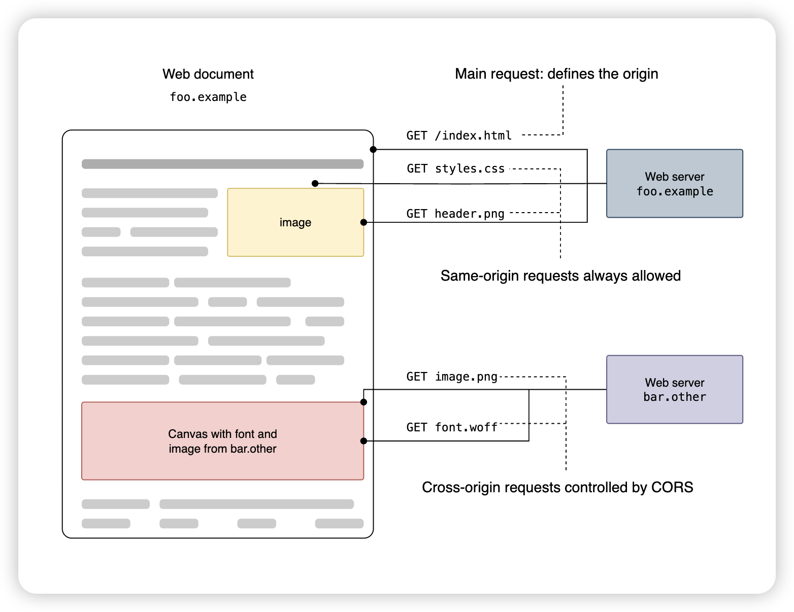

<!-- @import "[TOC]" {cmd="toc" depthFrom=1 depthTo=6 orderedList=false} -->
<!-- code_chunk_output -->

- [预备知识](#预备知识)
  - [1.源（域）的概念](#1源域的概念)
  - [2.跨域的概念](#2跨域的概念)
  - [3.同源（same-origin policy）策略的概念](#3同源same-origin-policy策略的概念)
- [Overview](#overview)
  - [1.CORS(cross-origin resource sharing)](#1corscross-origin-resource-sharing)
  - [2.preflight request (Test CORS)](#2preflight-request-test-cors)
  - [3.The HTTP response headers](#3the-http-response-headers)
  - [4.Requests with credentials](#4requests-with-credentials)

<!-- /code_chunk_output -->

[xRef](https://developer.mozilla.org/en-US/docs/Web/HTTP/Guides/CORS)

### 预备知识
#### 1.源（域）的概念
* 协议
* 域名（即ip地址）
* 端口
#### 2.跨域的概念
允许从一个域中访问另一个域

#### 3.同源（same-origin policy）策略的概念
* 浏览器不允许从一个域中访问另一个域
* 当一个域向另一个域发送HTTP请求时，实际的请求发送过了，另一个域也给出了回复，但是**浏览器**会截获这个**回复**，然后给当前域返回一个错误

***

### Overview



#### 1.CORS(cross-origin resource sharing)

CORS is an HTTP-header based mechanism that allows **a server** to indicate any origins (domain, scheme, or port) other than its own from which **a browser** should permit loading resources.

* by adding new **HTTP headers** that let servers describe which origins are permitted to read that information from a web browser
* for HTTP request methods that can cause side-effects on server data (in particular, HTTP methods other than GET, or POST with certain MIME types), the specification mandates **that browsers** **"preflight"** the request, soliciting supported methods from the server with the HTTP OPTIONS request method

#### 2.preflight request (Test CORS)

* A preflight request is automatically issued by a browser and in normal cases

* e.g. a client might be asking a server if it would allow a DELETE request
```bash
curl -i -X OPTIONS https://foo.bar.org/resource/foo \
  -H "Access-Control-Request-Method: DELETE" \
  -H "Access-Control-Request-Headers: x-requested-with" \
  -H "Origin: https://foo.bar.org"
```

* If the server allows it, then it will respond 
```http
HTTP/1.1 204 No Content
Connection: keep-alive
Access-Control-Allow-Origin: https://foo.bar.org
Access-Control-Allow-Methods: POST, GET, OPTIONS, DELETE
Access-Control-Allow-Headers: X-Requested-With
Access-Control-Max-Age: 86400
```

#### 3.The HTTP response headers

```yaml
Access-Control-Allow-Origin: <origin> | *
Access-Control-Allow-Methods: <method>[, <method>]*

# used in response to preflight request
Access-Control-Allow-Headers: <header-name>[, <header-name>]*

# adds the specified headers to the allowlist that JavaScript in browsers is allowed to access
Access-Control-Expose-Headers: <header-name>[, <header-name>]*
```

#### 4.Requests with credentials
* the server needs credentials from the client to compliment the request

*  The response to a preflight request must specify `Access-Control-Allow-Credentials: true`

* When responding to a credentialed request:
  * must instead specify an explicit origin:
    * e.g. `Access-Control-Allow-Origin: https://example.com`
  * must instead specify an explicit list of header names:
    * e.g. `Access-Control-Allow-Headers: X-PINGOTHER, Content-Type`
  * must instead specify an explicit list of method names
    * e.g. `Access-Control-Allow-Methods: POST, GET`
  * must instead specify an explicit list of header names
    * e.g. `Access-Control-Expose-Headers: Content-Encoding, Kuma-Revision`
