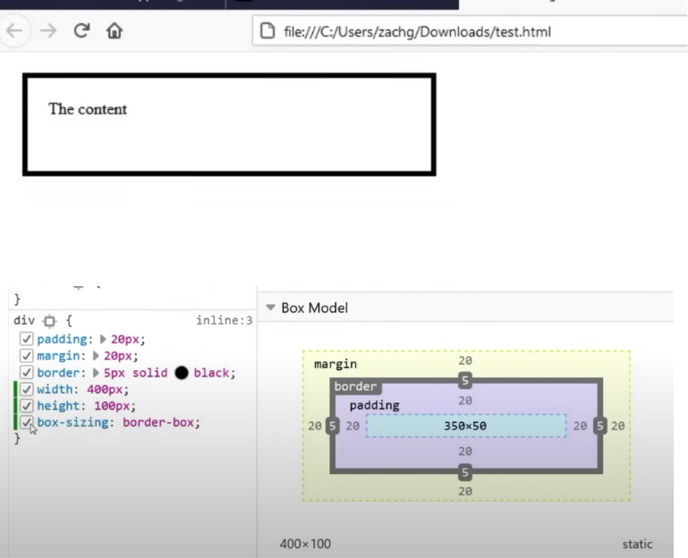
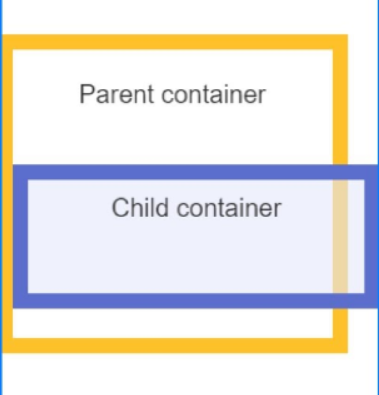
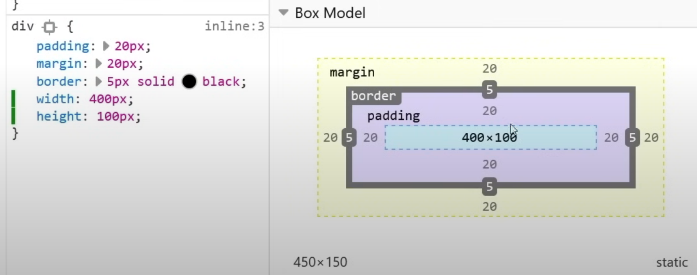
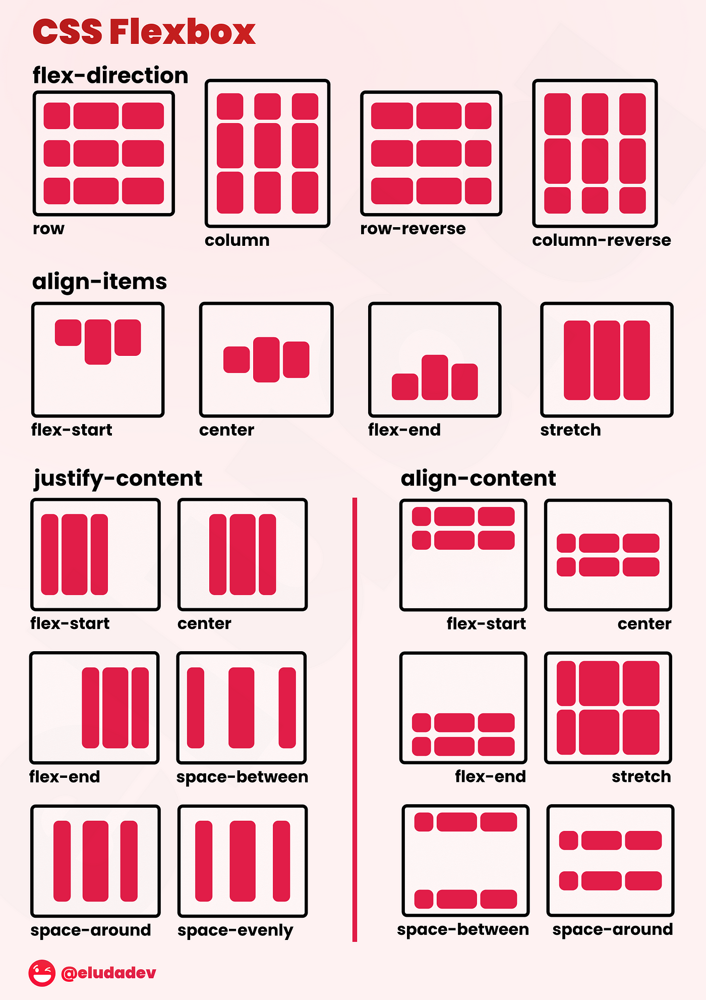
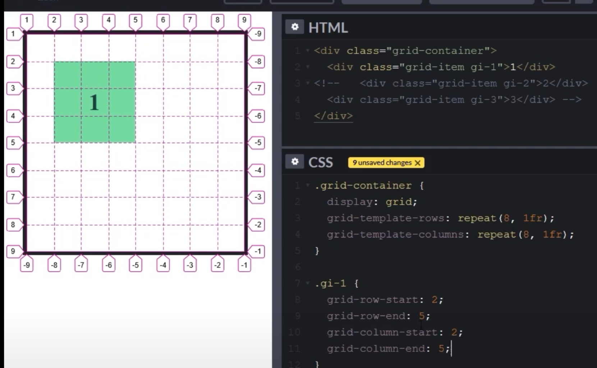
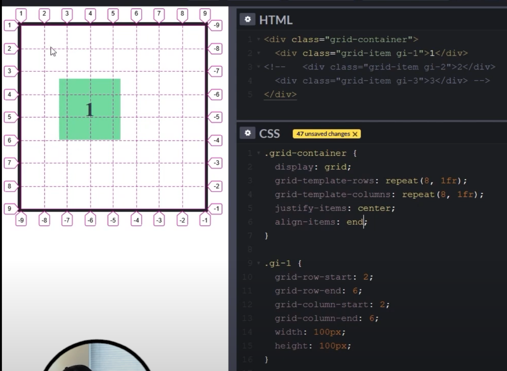

# CSS


<!-- @import "[TOC]" {cmd="toc" depthFrom=1 depthTo=6 orderedList=false} -->

<!-- code_chunk_output -->

- [CSS](#css)
    - [Overview](#overview)
      - [1.CSS selector](#1css-selector)
      - [2.precedence](#2precedence)
    - [Layout](#layout)
      - [1.box model](#1box-model)
        - [(1) box type](#1-box-type)
        - [(2) related properties](#2-related-properties)
        - [(3) display type](#3-display-type)
      - [2.responsive design](#2responsive-design)
        - [(1) mobile-first vs desktop-first](#1-mobile-first-vs-desktop-first)
        - [(2) breakpoints and media queries](#2-breakpoints-and-media-queries)
      - [3.flexbox](#3flexbox)
      - [4.grid](#4grid)

<!-- /code_chunk_output -->


### Overview

#### 1.CSS selector

* select elements having the "some-class" class attribute
```css
.some-class {
    color: red;
}
```

* select the element which id is "p-1"
```css
#p-1 {
    color: red;
}
```

* select all the `<p></p>` elements
```css
p {
    color: red;
}
```

* select list elements which have the "some-class" class
```html
<div class="some-class">
    <li>item1</li>
    <li>item2</li>
</div>
<div>
    <li>item1</li>
    <li>item2</li>
</div>
```
```css
.some-class li {
    color: red;
}
``` 

#### 2.precedence

越具体优先级越高: id > class > tag

```css
/* !important means the highest precedence */
p {
    color: blue !important;
}
```

***

### Layout

#### 1.box model

* describes how much space an HTML element occupies

##### (1) box type
* border box
    * 
    * the border box won't break out parent container
    

* context box (default)
    * 

##### (2) related properties
* Content Width
* Content Height
* Line Heigt
* Padding
* Border
* Margin
* Box Type
* Display Type

##### (3) display type


* block
* inline
* inline block

#### 2.responsive design

##### (1) mobile-first vs desktop-first

* mobile-first: set a default CSS style for mobile device , if reach break points (for example: window size is greater than 300px) then set another style for it.

##### (2) breakpoints and media queries
* html
```html
<h1>This is content</h1>
```

* CSS
```css
/* On screen sizes >= 756px, apply these CSS rules */
@media (min-width: 756px) {
    h1 {
        color: red;
    }
}
```

#### 3.flexbox
[visual cheatsheet](https://flexbox.malven.co/)

* flex container
    * `display: flex`
* flex items
    * children of the flex container

* be able to make complex layouts of flex items in the flex container



#### 4.grid

[visual cheatsheet](https://grid.malven.co/)

* grid container
    * `display: grid`
* grid items
    * children of the grid container


