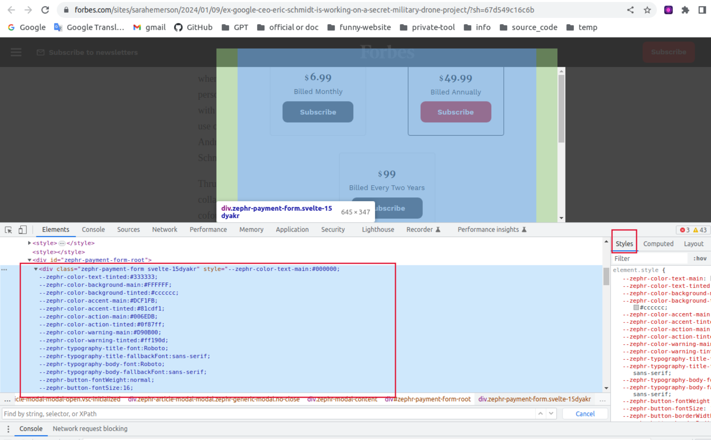
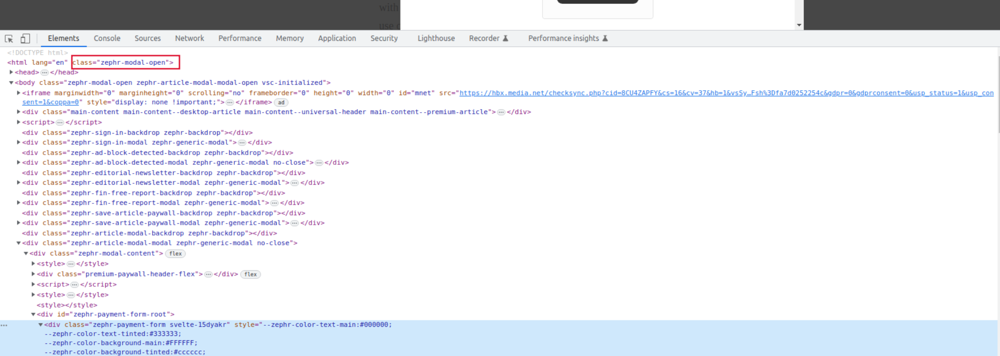
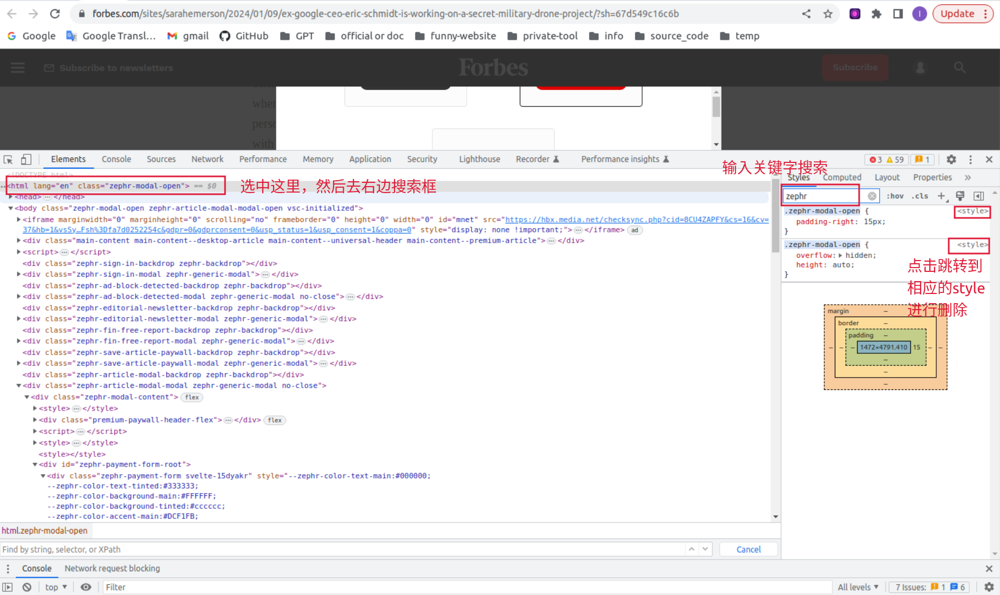

# overview

<!-- @import "[TOC]" {cmd="toc" depthFrom=1 depthTo=6 orderedList=false} -->

<!-- code_chunk_output -->

- [overview](#overview)
    - [概述](#概述)
      - [1.modal backdrop](#1modal-backdrop)
        - [(1) 基本实现](#1-基本实现)
        - [(2) 去除模态框](#2-去除模态框)

<!-- /code_chunk_output -->

### 概述

#### 1.modal backdrop

##### (1) 基本实现

* 通过javascript，对原html网页加上模态框

* 主要通过 设置html的class属性，应用自定义的模态框类

##### (2) 去除模态框

* 方法一: 禁止javascript
    * 开发者模式 -> 三个点 -> Run command -> 输入java -> disable javascript
    * 关闭开发者模式就不再禁用
    

* 方法二：删除html中相应的element
    * 定位到模态框的div相关信息
        * 查看使用的style，找关键词（比如: zephr）
    

    * 查看整个html使用的class
        * 刚开始加载时是没有class，加载了一会，弹出模态框就有了class
            * 说明这个class用于模态框的
    

    * 在head中，搜索相应的style，并删除
    
    
    * 在body中，删除相应的模态框element
        * 一般输出style就可以了，这一步一般不需要