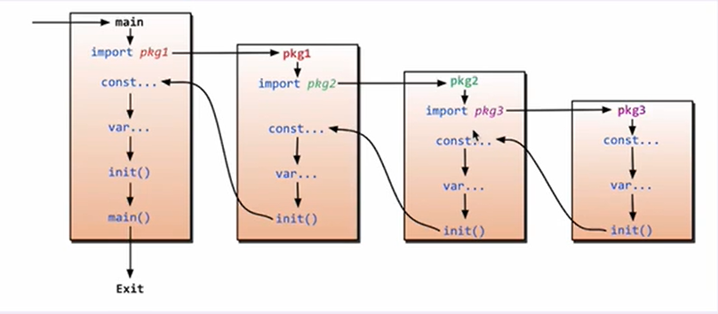

# package management

<!-- @import "[TOC]" {cmd="toc" depthFrom=1 depthTo=6 orderedList=false} -->
<!-- code_chunk_output -->

- [package management](#package-management)
    - [概述](#概述)
      - [1.定义包（就是一个go文件）](#1定义包就是一个go文件)
      - [2.import处理流程](#2import处理流程)
      - [3.import使用](#3import使用)
      - [4.包中的标识符命名规则（必须遵循）](#4包中的标识符命名规则必须遵循)

<!-- /code_chunk_output -->

### 概述

#### 1.定义包（就是一个go文件）
* 多个go文件的是`<package_name>`可以是一样的，这样就不用import了
  * 一般同一层文件夹中的`<package_name>`是一样的
```go
//package <package_name> 很重要，import时就是import的<package_name>
package <package_name>

//导入该包时，会执行的函数
func init () {
  ...
}
```

#### 2.import处理流程
* 程序的入口是main包
* 然后执行main包中的import
* 跳转到import的包中
  * 执行import
  * 执行全局变量和常量的声明
  * 执行`init()`函数
* 执行main包中的`init()`函数
* 执行main包中的`main()`函数



#### 3.import使用
```go
import (
  "lib1"
  _ "lib2"      //通过匿名方式导包，即不使用这个包，编译不会报错
  mylib "lib3"  //通过别名方式导包
)
```

#### 4.包中的标识符命名规则（必须遵循）
* 包中的标识符（变量名\函数名等）
  * 如果首字母小写，表示私有（即只能在这个包中使用）
  * 如果首字母大写，表示被外部所调用
