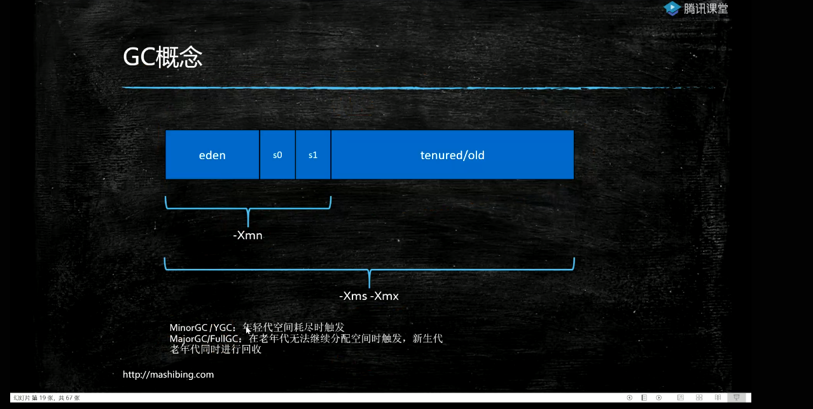

# JVM

<!-- @import "[TOC]" {cmd="toc" depthFrom=1 depthTo=6 orderedList=false} -->
<!-- code_chunk_output -->

- [JVM](#jvm)
    - [概述](#概述)
      - [1.相关术语](#1相关术语)
      - [2.基础概念](#2基础概念)
        - [（1）jvm](#1jvm)
        - [（2）java是编译和解释型语言](#2java是编译和解释型语言)
      - [3.java编译和c编译比较](#3java编译和c编译比较)
    - [GC（Garbage Collection）](#gcgarbage-collection)
      - [1.垃圾的定义](#1垃圾的定义)
      - [2.三种GC回收算法](#2三种gc回收算法)
        - [（1）Mark-Sweep（标记清除）](#1mark-sweep标记清除)
        - [（2）Copying（拷贝）](#2copying拷贝)
        - [（3）Mark-compact（压缩标记）](#3mark-compact压缩标记)
      - [3.十种垃圾回收器（garbage collector）](#3十种垃圾回收器garbage-collector)
      - [4.分代模型（新生代和老年代）](#4分代模型新生代和老年代)
      - [5.回收过程](#5回收过程)
      - [6.回收过程其他说明](#6回收过程其他说明)
    - [jvm监控工具](#jvm监控工具)
      - [1.`jps`（JVM process status）](#1jpsjvm-process-status)
      - [2.`jstat`（JVM statistics Monitoring）](#2jstatjvm-statistics-monitoring)
      - [3.`jinfo`（JVM configuration info）](#3jinfojvm-configuration-info)
      - [4.`jmap`（jvm memory map）](#4jmapjvm-memory-map)
      - [5.`jstack`（thread stack trace for a java process）](#5jstackthread-stack-trace-for-a-java-process)

<!-- /code_chunk_output -->

### 概述
#### 1.相关术语
* jvm：java virtual machine          
功能：内存管理
</br>
* jre：java runtime environment      
运行一定需要jre，包含jvm
</br>
* jdk：java development kit          
提供编译工具，监控jvm的工具，包含jre
</br>
* java特点
write once run everywhere,需要有jvm的支持
</br>
* GC：garbage collection
垃圾回收，用于回收JVM中的内存
c和c++需要手动回收内存，jvm会自动回收

#### 2.基础概念
##### （1）jvm
* 有一个java进程，就有一个jvm
* 用于运行字节码，将字节码转换成机器码
  * 在其他编程语言中，编译器为**特定系统**生成机器代码
  * java编译器会为jvm生成代码（即字节码）

##### （2）java是编译和解释型语言
* 编译：将代码转换成字节码
* 解释：将字节码转换成机器码

#### 3.java编译和c编译比较
* c语言编译

</br>
* java编译


***
### GC（Garbage Collection）
#### 1.垃圾的定义
从main中的根对象出发，一直遍历下去，没有被引用的对象就是垃圾

下图中，g、h和i都是垃圾
```plantuml
frame main{
  circle a
  circle b
  circle c
}
circle d
circle e
circle f
circle g
circle h
circle i
a-->d
d-->e
c-->f
g-->h
h->i
i->g
```

#### 2.三种GC回收算法
##### （1）Mark-Sweep（标记清除）
标记出哪些是垃圾，然后清除
缺点：存在碎片问题
##### （2）Copying（拷贝）
将物理内存一分为2，只用一半内存，清理时，将所有非垃圾对象移动到其中一半，然后清除另一个
特点：效率高，但是浪费空间
##### （3）Mark-compact（压缩标记）
标记出哪些是垃圾，将非垃圾对象移动到一起，清除垃圾
特点：效率低

#### 3.十种垃圾回收器（garbage collector）


#### 4.分代模型（新生代和老年代）


* 会将内存在物理和逻辑上进行分区
新生代区：eden s0 s1     （s:survivor）
老年代区：old（空间较大）

#### 5.回收过程
* 刚刚生成的对象，会存放eden区
eden满了会进行垃圾回收，eden区大部分对象都会被回收
* 没有被回收的对象进入s0
* 当再次进行垃圾回收，eden和s0没有被回收的对象进入s1，然后清空eden和s0空间，这样效率高
* 当再次进行垃圾回收，eden和s1没有被回收的对象进入s0
* 上面的步骤重复进行
* 每回收一次，对象的年龄增加一岁，当达到指定岁数，该对象就会进入老年代区


#### 6.回收过程其他说明
* 每次进行垃圾回收时，都会STW（stop-the-world），即停止业务进程，只进行垃圾回收

***

### jvm监控工具
#### 1.`jps`（JVM process status）
```shell
jps
    -l        #输出完全的包名，应用主类名，jar的完全路径名
    -v        #输出jvm参数
    -m        #输出传入 main 方法的参数
```
#### 2.`jstat`（JVM statistics Monitoring）
```shell
jstat <OPTION> <VMID>   #VMID就是JVM的id，即进程号

#<OPTION>:

  -class              #类加载统计
#Loaded:加载class的数量
#Bytes：所占用空间大小
#Unloaded：未加载数量
#Bytes:未加载占用空间
#Time：时间

  -compiler           #编译统计
#Compiled：编译数量。
#Failed：失败数量
#Invalid：不可用数量
#Time：时间
#FailedType：失败类型
#FailedMethod：失败的方法

  -gc                 #gc统计
#S0C：第一个幸存区的大小
#S1C：第二个幸存区的大小
#S0U：第一个幸存区的使用大小
#S1U：第二个幸存区的使用大小
#EC：伊甸园区的大小
#EU：伊甸园区的使用大小
#OC：老年代大小
#OU：老年代使用大小
#MC：方法区大小
#MU：方法区使用大小
#CCSC:压缩类空间大小
#CCSU:压缩类空间使用大小
#YGC：年轻代垃圾回收次数
#YGCT：年轻代垃圾回收消耗时间
#FGC：整个堆垃圾回收次数，当这个数量特别多的时候，程序可能有问题，可能发生了内存泄漏
      #当新生代的晋升大小 大于 老年代的剩余大小时，会发生full gc
#FGCT：整个堆垃圾回收消耗时间
#GCT：垃圾回收消耗总时间

  -gcutil           #gc比例统计
#S0：幸存1区当前使用比例
#S1：幸存2区当前使用比例
#E：伊甸园区使用比例
#O：老年代使用比例
#M：元数据区使用比例
#CCS：压缩使用比例
#YGC：年轻代垃圾回收次数
#FGC：整个堆垃圾回收次数
#FGCT：整个堆垃圾回收消耗时间
#GCT：垃圾回收消耗总时间
```

#### 3.`jinfo`（JVM configuration info）
```shell
jinfo <OPTION> <VMID>

#<OPTION>:
  -flags      #输出VM flags，可以看出用的哪个垃圾回收算法
  -sysprops   #输出java system properties
```
#### 4.`jmap`（jvm memory map）
```shell
jmap <OPTION> <VMID>

#<OPTION>:
  -heap       #打印heap的信息，包括各个分代使用情况
```

#### 5.`jstack`（thread stack trace for a java process）
```shell
jstack -l <VMID>   

#跟踪某个java进程中的所有线程的栈，能够获取以下信息：
#   1.线程的状态（java.lang.Thread.State）
#   2.能够检查是否发生了死锁（Found one Java-level deadlock:）
```
