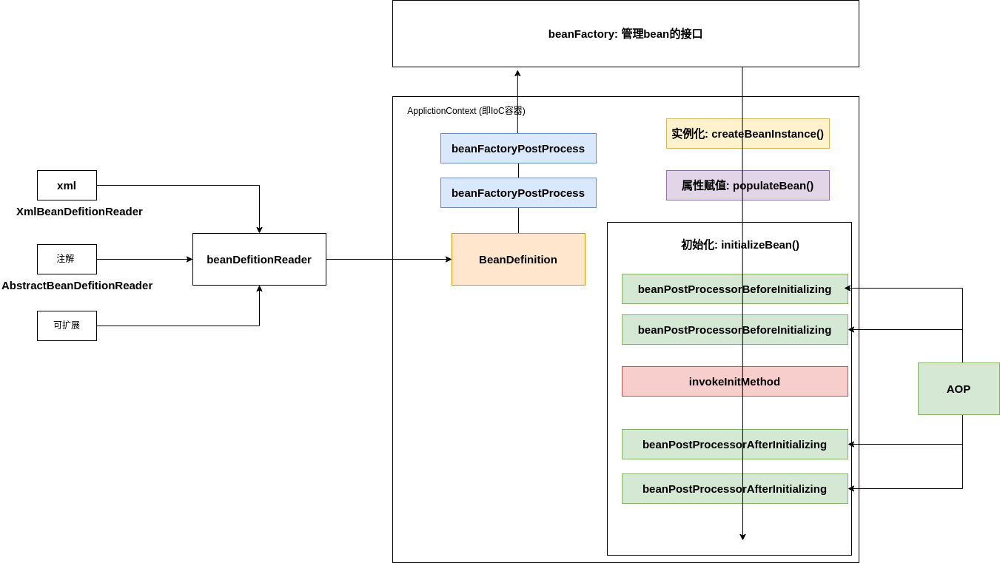

# IoC container

<!-- @import "[TOC]" {cmd="toc" depthFrom=1 depthTo=6 orderedList=false} -->
<!-- code_chunk_output -->

- [IoC container](#ioc-container)
    - [概述](#概述)
      - [1.spring IoC(inversion of control) containers](#1spring-iocinversion-of-control-containers)
      - [2.基本概念](#2基本概念)
        - [（1）组件（即对象，即bean）](#1组件即对象即bean)
      - [3.组件的三种类型](#3组件的三种类型)
    - [使用](#使用)
      - [1.注册组件](#1注册组件)
        - [（1）定义一个类](#1定义一个类)
        - [（2）手动方式创建对象](#2手动方式创建对象)
        - [（3）基于 配置类注解 注册组件](#3基于-配置类注解-注册组件)
        - [（4）基于`@Component`注解注册组件](#4基于component注解注册组件)
      - [2.自动装配](#2自动装配)
    - [源码分析](#源码分析)
      - [1.基础](#1基础)
        - [(1) 怎么知道要创建什么bean对象](#1-怎么知道要创建什么bean对象)
        - [(2) 如何存储创建的bean对象](#2-如何存储创建的bean对象)
        - [(3)容器如何管理bean对象](#3容器如何管理bean对象)
      - [2.循环依赖问题](#2循环依赖问题)
      - [3.spring源码解析](#3spring源码解析)
        - [(1) 启动流程](#1-启动流程)
        - [(2) 创建bean（在上面的好几个阶段都可能有bean的创建）](#2-创建bean在上面的好几个阶段都可能有bean的创建)

<!-- /code_chunk_output -->

### 概述

#### 1.spring IoC(inversion of control) containers
控制反转容器，是spring的核心
将对象的创建进行反转，正常对象都是开发者手动创建的，现在则是由IoC容器根据需求自动创建对象
* 不使用IoC: 所有对象开发者自己创建
* 使用IoC: 对象由Spring框架创建

#### 2.基本概念

#####（1）组件（即对象，即bean）
创建的对象

#### 3.组件的三种类型

* controller

* service
* repository

***

### 使用

#### 1.注册组件

##### （1）定义一个类
```java
@Data
@AllArgsConstructor
@NoArgsConstructor
public class DataConfig {
    private String url;
    private String driverName;
    private String username;
    private String password;
}
```

##### （2）手动方式创建对象
```java
public class Test {
    public static void main(String[] args) {
        DataConfig dataConfig = new DataConfig();
        dataConfig.setDriverName("Driver");
        dataConfig.setUrl("localhost:3306/dbname");
        dataConfig.setUsername("root");
        dataConfig.setPassword("password");
        System.out.println(dataConfig);
    }
}

```

##### （3）基于 配置类注解 注册组件

* 创建一个配置类

```java
@Configuration  //表示这是一个配置类
public class BeanConfiguration {

    @Bean(name="bean1")  //表示这是一个bean（IoC可以用这个自动生成对象）
    public DataConfig dataConfig(){
        DataConfig dataConfig = new DataConfig();
        dataConfig.setDriverName("Driver");
        dataConfig.setUrl("localhost:3306/dbname");
        dataConfig.setUsername("root");
        dataConfig.setPassword("password");
        return dataConfig;
    }
}
```

* 利用注解创建对象
```java
public class Test {
    public static void main(String[] args) {
        ApplicationContext context = new AnnotationConfigApplicationContext(BeanConfiguration.class);
        System.out.println(context.getBean("bean1"));
        System.out.println(context.getBean(DataConfig.class));

    }
}
```

* 当bean很多时，可以利用扫包的方式
```java
public class Test {
    public static void main(String[] args) {
        ApplicationContext context = new AnnotationConfigApplicationContext("com.example");
        System.out.println(context.getBean("bean1"));
        System.out.println(context.getBean(DataConfig.class));

    }
}
```

##### （4）基于`@Component`注解注册组件

* 定义类时，通过注解说明使用IoC创建该对象
```java
@Data
@AllArgsConstructor
@NoArgsConstructor
@Component   //表示该类是一个组件（即对象），即会创建一个bean（使用下面的value）
public class DataConfig {
    @Value("localhost:3306")
    private String url;
    @Value("mysql")
    private String driverName;
    @Value("root")
    private String username;
    @Value("password")
    private String password;
}
```

* 扫包并创建对象
```java
public class Test {
    public static void main(String[] args) {
        ApplicationContext context = new AnnotationConfigApplicationContext("com.example");
        System.out.println(context.getBean(DataConfig.class));
    }
}

```

#### 2.自动装配
根据指定的策略，在IoC容器中匹配某一个bean，用来给当前bean的某个属性赋值
比如: 默认为byType策略，某个Car的bean，有一个tyre属性（类型为Tyre），则会在IoC容器寻找Tyre这个类型的bean，来为Car的tyre属性赋值，如果有多个Tyre类型则失败

* `GlobalConfig.java`
```java
@Data
@AllArgsConstructor
@NoArgsConstructor
@Component
public class GlobalConfig {
    private String name;
}
```
* `DataConfig.java`
```java
//默认为byType策略
@Data
@AllArgsConstructor
@NoArgsConstructor
@Component
public class DataConfig {
    private String url;
    private String driverName;
    private String username;
    private String password;
    @Autowired
    private GlobalConfig globalConfig;
}

//或者
//明确指定使用byName策略
@Data
@AllArgsConstructor
@NoArgsConstructor
@Component
public class DataConfig {
    private String url;
    private String driverName;
    private String username;
    private String password;
    @Autowired
    @Qualifier("xx")
    private GlobalConfig globalConfig;
}
```

***

### 源码分析

#### 1.基础
##### (1) 怎么知道要创建什么bean对象
* 配置文件
* 注解

##### (2) 如何存储创建的bean对象
* bean对象存储在容器里
    * 容器的本质就是许多个map，存储自动创建的bean对象

##### (3)容器如何管理bean对象
对bean对象的生命周期进行管理（创建、使用、回收等）

#### 2.循环依赖问题

* 问题描述: 
    * 容器内bean对象默认是单例模式
    * A对象初始化需要赋值B对象
    * B对象初始化需要赋值A对象
* 解决方案:
    * 将实例化和初始化分开 和 三级缓存
        * 这样即使初始化未完成，也能进行对象赋值
        * 一级缓存: 存放完整的bean对象
        * 二级和三级缓存: 用于过渡，存放实例化但未初始化的bean对象

#### 3.spring源码解析

* beanFactory是管理bean对象的接口
* ApplicationContext是IoC容器，存储和管理bean对象的类（这个类实现了beanFactory这个接口）
* `META-INF/spring.factories`
    * 用于指定AutoConfiguration Classes
    * 为什么需要这个文件: 
        * 因为我们整个项目里面的入口文件只会扫描整个项目里面下的@Compont @Configuration等注解，但是如果我们是引用了其他jar包，而其他jar包只有@Bean或者@Compont等注解，是不会扫描到的。

##### (1) 启动流程
* 创建SpringApplication
    * 初始化一些变量
        * webapplicationtype（比如 servelet）
        * set initializer
            * 在META-INFO/spring.factories中寻找ApplicationContextInitializer
        * set listener
            * 在META-INFO/spring.factories中寻找ApplicationListener
* 执行SpringApplication run方法
    * 读取environment信息（即配置文件、环境变量等）
    * create IoC容器: createApplicationContext()
    * prepare IoC容器
        * 设置environment、listener等
        * 应用初始化器
    * refresh IoC容器
        * prepareRefresh()
            * 设置environment、listener等
        * 创建beanFactory 
        * invokeBeanFactoryPostProcessors()
            * 自动装配: 加载所有beanDefinition
        * 在beanFactory中注册beanPostProcessors
        * 创建web server: onRefresh()
        
##### (2) 创建bean（在上面的好几个阶段都可能有bean的创建）
* 实例化: createBeanInstance()
* 属性赋值: populateBean()
* 初始化: initializeBean()
    * 根据bean类型进行相关对象赋值: invokeAwareMethods()
    * beanPostProcessorsBeforeInitialization
    * invokeInitMethod
    * beanPostProcessorsAfterInitialization

