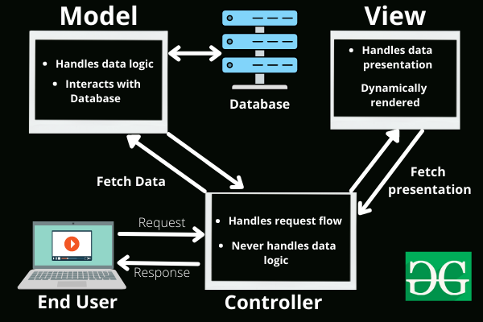

# overview

<!-- @import "[TOC]" {cmd="toc" depthFrom=1 depthTo=6 orderedList=false} -->

<!-- code_chunk_output -->

- [overview](#overview)
    - [概述](#概述)
      - [1.global static variable vs local static variable](#1global-static-variable-vs-local-static-variable)
      - [2.类、抽象类、接口](#2类-抽象类-接口)
      - [3.MVC](#3mvc)

<!-- /code_chunk_output -->

### 概述

#### 1.global static variable vs local static variable

* 相同点
    * 生命周期都跟程序的生命周期一样
* 不同点
    * global static variable，可以全局访问
    * local static variable，只能局部访问

#### 2.类、抽象类、接口

* 类 是 对对象的抽象
* 抽象类 是 对类的抽象
* 接口 是 对行为的抽象

#### 3.MVC
