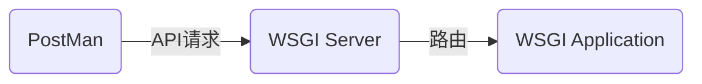
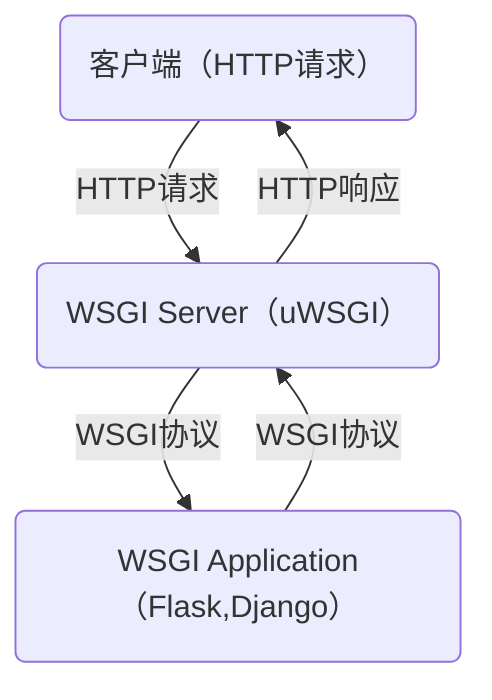

<!-- @import "[TOC]" {cmd="toc" depthFrom=1 depthTo=6 orderedList=false} -->
<!-- code_chunk_output -->

- [WSGI](#wsgi)
    - [概述](#概述)
      - [1.WSGI](#1wsgi)
      - [2.WSGI对application对象有如下三点要求](#2wsgi对application对象有如下三点要求)
      - [3.web服务器（服务端）和web框架（应用端）区别](#3web服务器服务端和web框架应用端区别)
      - [4.HTTP如何到达应用程序的](#4http如何到达应用程序的)

<!-- /code_chunk_output -->

# WSGI
**本质**
```
WSGI是一种协议，
WSGI服务器本质是socket，用于接收HTTP请求，
然后发送给后端应用（比如django），
后端会处理这个请求，然后返回响应到WSGI，
然后WSGI再返回给客户端
```
### 概述
#### 1.WSGI
web server gateway interface，是一种协议，一种规范，一种接口，用于处理HTTP请求，然后路由到后端的应用
WSGI接口有服务端和应用端两部分，服务端也可以叫网关端，应用端也叫框架端  
* WSGI Server（服务端）常用的软件：uWSGI
* WSGI Application（应用端）常用软件：Flask、Django
这些框架会自己附带一个wsgi服务器，开发阶段用的，生产环境是不够用的


#### 2.WSGI对application对象有如下三点要求
* 必须是一个**可调用**的对象
* 接收两个必选参数environ、start_response
* 返回值必须是**可迭代**对象，用来表示http body

#### 3.web服务器（服务端）和web框架（应用端）区别
* web 服务器专注于接收并解析请求，以调用的方式将请求的内容传web框架
* 两个组件间的通信协议就是WSGI

#### 4.HTTP如何到达应用程序的

