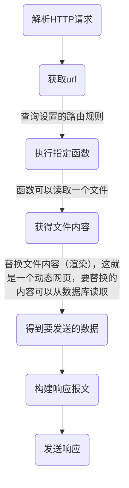

# Flask

<!-- @import "[TOC]" {cmd="toc" depthFrom=1 depthTo=6 orderedList=false} -->
<!-- code_chunk_output -->

- [Flask](#flask)
    - [概述](#概述)
      - [1.web框架的本质](#1web框架的本质)
      - [2.web框架可提供的功能](#2web框架可提供的功能)
      - [3.三类web框架](#3三类web框架)

<!-- /code_chunk_output -->

### 概述
#### 1.web框架的本质
通过解析http请求，获取**url**，然后根据url，执行**相应函数**，该函数用于返回数据，返回的数据本质都是**字符串（字节类型）** ，可以读取一个文件返回其中的内容，读取文件后，可以替换其中的相应内容，则这个文件就被称为**模板**，这个替换操作就叫**渲染（render）** ，最后构建HTTP响应报文，发送回去

#### 2.web框架可提供的功能
* socket服务端
* 路由系统
* 模板渲染

#### 3.三类web框架
* a, b, c
Tornado
 
* [第三方a], b, c
Django（socket服务端使用的是wsgiref提供的功能）
 
* [第三方a], b, [第三方c]
Flask（socket服务端可以使用wsgiref，模板渲染用的是jinja2）
>a：socket服务端
b：路由系统
c：模板渲染
