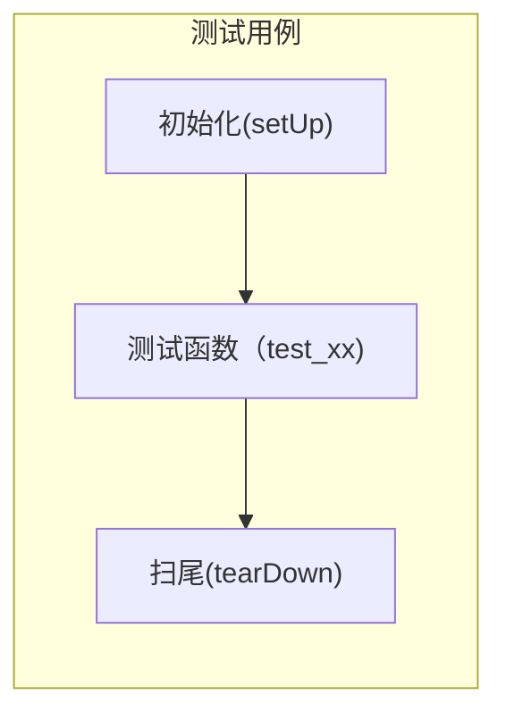

# unittest测试框架

<!-- @import "[TOC]" {cmd="toc" depthFrom=1 depthTo=6 orderedList=false} -->
<!-- code_chunk_output -->

- [unittest测试框架](#unittest测试框架)
    - [1.核心概念](#1核心概念)
  - [2.原理图](#2原理图)
  - [3.创建测试类](#3创建测试类)
    - [4.进行测试](#4进行测试)
        - [4.1 按照指定顺序执行测试用例](#41-按照指定顺序执行测试用例)
        - [4.2 按照默认顺序](#42-按照默认顺序)
    - [5.demo](#5demo)

<!-- /code_chunk_output -->

### 1.核心概念
**TestCase**
>一个TestCase的实例就是测试用例，就是一个完整的测试流程，包括测试前准备环境的搭建(setUp)，执行测试代码(run)，以及测试后环境的还原(tearDown)

**TestSuit**
>多个测试用例集合在一起，就是TestSuite

**TestLoader**
>TestLoader是用来加载TestCase到TestSuite中的，其中有几个loadTestsFrom__()方法，就是从各个地方寻找TestCase，创建它们的实例，然后add到TestSuite中，再返回一个TestSuite实例。

**TextTestRunner**
>TextTestRunner是来执行测试用例的，其中的run(test)会执行TestSuite/TestCase中的run(result)方法

**TextTestResult**
>测试的结果会保存到TextTestResult实例中，包括运行了多少测试用例，成功了多少，失败了多少等信息

## 2.原理图


## 3.创建测试类
（1）流程图

（2）test_demo.py
```python
import unittest
import demo                       #导入需要被测试的单元

class TestDemo(unittest.TestCase):

    def setUp(self):
        #初始化工作，这里面做初始操作
        pass

    def test_demo1(self,args):         #注意这里必须以test_开头
        #利用断言进行判断
        pass

    def test_demo2(self,args):
        #利用断言进行判断
        pass

    def tearDown(self):
        #扫尾工作，这里面做单元测试结束后的工作
        pass

#当创建类实例时，我们必须通过向构造器传递方法的名称来指明哪个测试方法将被运行
#TestDemo("test_demo1")
```
（3）常用断言
```python
assertTrue(<VALUE>, <MSG>)     #每个断言后都可以加 断言失败输出的信息
```
|断言函数|检查条件|
|-|-|
|assertEqual(a, b)|a == b|
|assertNotEqual(a, b)|a != b|
|assertTrue(x)|	bool(x) is True|
|assertFalse(x)|	bool(x) is False|
|assertIn(a, b)|	a in b|
|assertNotIn(a, b)	|a not in b|
（4）参数化测试用例
**注意**：使用参数化时，需要注意，在指定位置启动，比如在unittest.main()中启动测试
```python
from parameterized import parameterized

class TestDemo():
    @parameterized.expand([
    (1,2),
    (2,3),
    (11,11),
    ])
    def test_demo1(self,arg1,arg2):
        pass
```
（5）跳过测试
```python
@unittest.skip(reason)
#跳过被此装饰器装饰的测试。 reason 为测试被跳过的原因。

@unittest.skipIf(condition, reason)
#当 condition 为真时，跳过被装饰的测试。

@unittest.skipUnless(condition, reason)
#跳过被装饰的测试，除非 condition 为真。

@unittest.expectedFailure
#把测试标记为预计失败。如果测试不通过，会被认为测试成功；如果测试通过了，则被认为是测试失败。
```
>例子
```python
class MyTestCase(unittest.TestCase):

    @unittest.skip("demonstrating skipping")
    def test_nothing(self):
        self.fail("shouldn't happen")

    @unittest.skipIf(mylib.__version__ < (1, 3),
                     "not supported in this library version")
    def test_format(self):
        # Tests that work for only a certain version of the library.
        pass

    @unittest.skipUnless(sys.platform.startswith("win"), "requires Windows")
    def test_windows_support(self):
        # windows specific testing code
        pass

    def test_maybe_skipped(self):
        if not external_resource_available():
            self.skipTest("external resource not available")
        # test code that depends on the external resource
        pass
```
>输出程序如下：
```python
test_format (__main__.MyTestCase) ... skipped 'not supported in this library version'
test_nothing (__main__.MyTestCase) ... skipped 'demonstrating skipping'
test_maybe_skipped (__main__.MyTestCase) ... skipped 'external resource not available'
test_windows_support (__main__.MyTestCase) ... skipped 'requires Windows'

----------------------------------------------------------------------
Ran 4 tests in 0.005s

OK (skipped=4)
```
### 4.进行测试
#####4.1 按照指定顺序执行测试用例
（1）创建测试集合
```python
def suite():
    suite = unittest.TestSuite()
    suite.addTest(TestDemo("test_demo1"))
    suite.addTest(TestDemo("test_demo2"))
    return suite
```
**注意：参数化的测试实例，不能用这种方法**

（2）执行测试
```python
if __name__ == "__main__":
    runner = unittest.TextTestRunner()
    runner.run(suite())
```
##### 4.2 按照默认顺序
>unittest模块包含一个main方法，可以方便地将测试模块转变为可以运行测试的脚本。main 使用unittest.TestLoader类来自动查找和加载模块内测试用例。
将以下代码插入测试模块的结尾：
```python
if __name__ == "__main__":
    unittest.main()
```
>这样，当你从命令行执行你的测试模块时，其所包含的所有测试都将被运行。使用“-h”选项运行模块可以查看所有可用的选项。
如需从命令行运行任意测试，你可以将unittest模块作为脚本运行，并将所需执行的测试套件中的测试用例名称作为参数传递给此脚本：
```shell
python test_demo.py -v
python test_demo.py TestDemo
```
### 5.demo
（1）目录结构
  

（2）mathfunc.py
```python
class Math:
    def add(self, a, b):
        return a+b

    def minus(self, a, b):
        return a-b

    def multi(self, a, b):
        return a*b

    def divide(self, a, b):
        return a/b
```
（3）test_mathfunc.py
```python
import unittest
from parameterized import parameterized
from mathfunc import Math


class TestMath(unittest.TestCase):

    def setUp(self):
        pass

    @parameterized.expand([
        ("01", 1, 1, 2),
        ("02", 2, 2, 4),
        ("03", 3, 3, 5),
    ])
    def test_add(self,name, a, b, c):
        try:
            m = Math()
            self.assertEqual(m.add(a, b), c, "加法计算错误")
        except AssertionError as e:
            print(e)
        else:
            print("测试数据是: ", name)

    @parameterized.expand([
        ("04", 3, 1, 2),
        ("05", 6, 3, 3),
        ("06", 5, 1, 2),
    ]
    )
    def test_minus(self, name, a, b, c):
        try:
            m = Math()
            self.assertEqual(m.minus(a, b), c, "减法计算错误")
        except AssertionError as e:
            print(e)
        else:
            print("测试数据是: ", name)


    @parameterized.expand([
        ("07", 3, 3, 9),
        ("08", 3, 2, 6),
        ("09", 1, 5, 5),

    ])
    def test_multi(self, name, a, b, c):
        try:
            m = Math()
            self.assertEqual(m.multi(a, b), c, "乘法计算错误")
        except AssertionError as e:
            print(e)
        else:
            print("测试数据是: ", name)

    @parameterized.expand([
        ("10", 5, 2, 2.5),
        ("11", 4, 1, 4.0),
        ("12", 10, 5, 2.5),

    ])
    def test_divide(self, name, a, b, c):
        try:
            m = Math()
            self.assertEqual(m.divide(a, b), c, "除法计算错误")
        except AssertionError as e:
            print(e)
        else:
            print("测试数据是: ", name)

    def tearDown(self):
        pass
```
（4）run_test.py
```python
import unittest
from tests.test_mathfunc import TestMath

if __name__ == '__main__':
    unittest.main()
```
（5）输出结果
```python
............
----------------------------------------------------------------------
Ran 12 tests in 0.001s

OK
测试数据是:  01
测试数据是:  02
6 != 5 : 加法计算错误
测试数据是:  10
测试数据是:  11
2.0 != 2.5 : 除法计算错误
测试数据是:  04
测试数据是:  05
4 != 2 : 减法计算错误
测试数据是:  07
测试数据是:  08
测试数据是:  09
```
