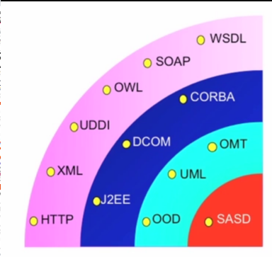
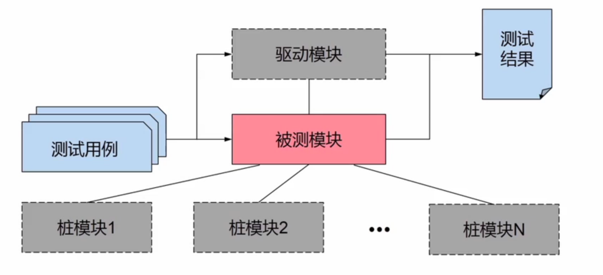
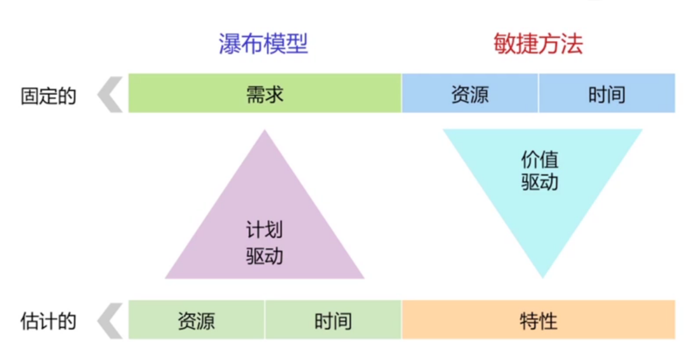
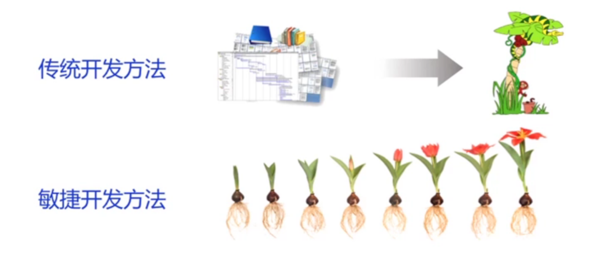
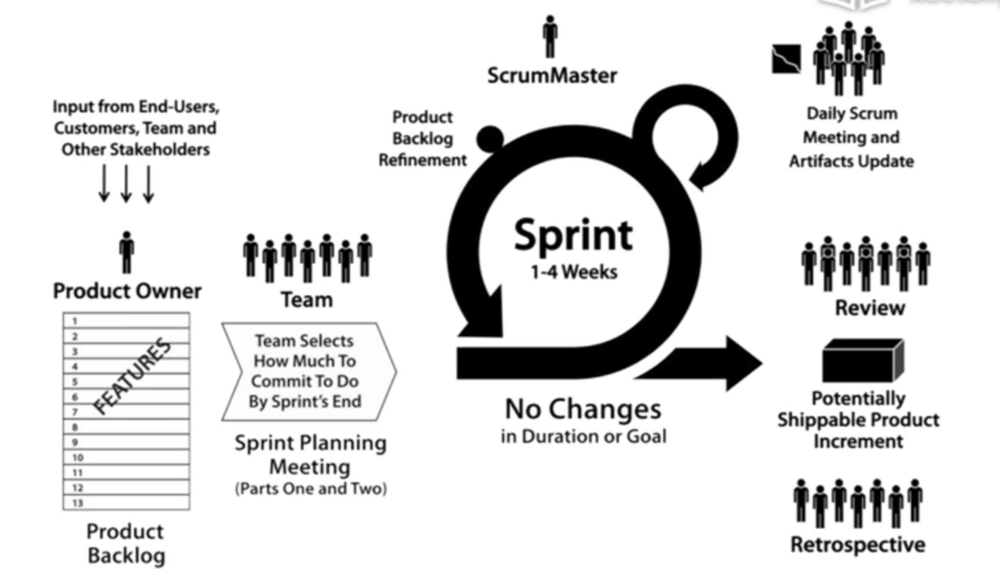
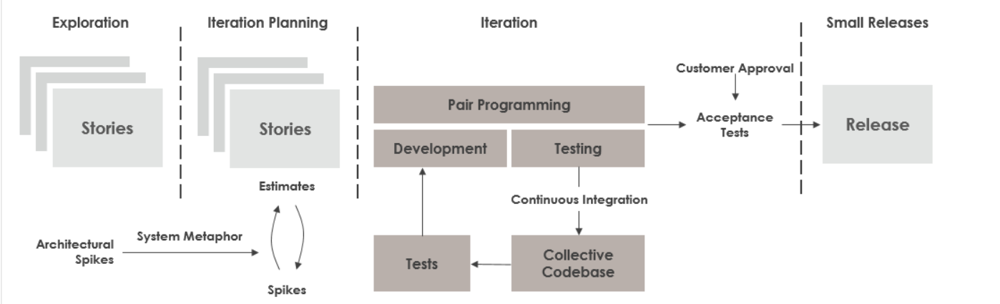
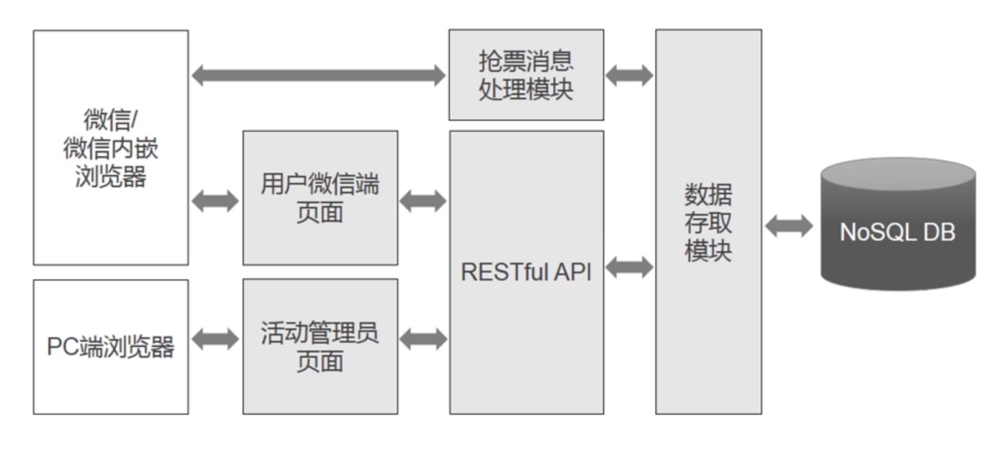
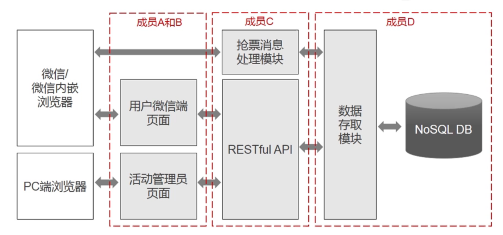

# overview

<!-- @import "[TOC]" {cmd="toc" depthFrom=1 depthTo=6 orderedList=false} -->

<!-- code_chunk_output -->

- [overview](#overview)
    - [概述](#概述)
      - [1.software engineering](#1software-engineering)
        - [(1) 过程](#1-过程)
        - [(2) 方法](#2-方法)
        - [(3) 工具](#3-工具)
      - [2.code review](#2code-review)
        - [(1) 静态代码分析工具](#1-静态代码分析工具)
        - [(2) 性能分析工具](#2-性能分析工具)
      - [3.unit test](#3unit-test)
        - [(1) 测试内容](#1-测试内容)
        - [(2) 测试过程](#2-测试过程)
        - [(3) mock测试](#3-mock测试)
        - [(4) 测试用例](#4-测试用例)
      - [4.过程模型](#4过程模型)
        - [(1) waterfall model (瀑布模型)](#1-waterfall-model-瀑布模型)
        - [(2) prototype model (原型化模型)](#2-prototype-model-原型化模型)
        - [(3) iterative model (迭代模型)](#3-iterative-model-迭代模型)
        - [(4) transformation model (转换模型)](#4-transformation-model-转换模型)
      - [5.敏捷开发](#5敏捷开发)
        - [(1) scrum开发方法](#1-scrum开发方法)
        - [(2) ExtremeProgramming (XP, 极限编程)开发方法](#2-extremeprogramming-xp-极限编程开发方法)
      - [6.软件项目计划](#6软件项目计划)
    - [scrum](#scrum)
      - [1.scrum框架](#1scrum框架)
        - [(1) 角色](#1-角色)
        - [(2) 制品](#2-制品)
        - [(3) 活动](#3-活动)
      - [2.scrum规划](#2scrum规划)
        - [(1) 发布规划](#1-发布规划)
        - [(2) 迭代计划](#2-迭代计划)
      - [3.user story](#3user-story)
        - [(1) 定义](#1-定义)

<!-- /code_chunk_output -->

### 概述

#### 1.software engineering

##### (1) 过程

* 问题定义
    * 提出问题和可行性研究
* 需求开发
    * 需求分析并编写需求文档
* 软件设计
    * 原型、架构、接口等设计
* 软件构造
    * 编写代码
* 软件测试
    * 单元测试
    * 子系统集成测试
    * 系统集成测试
    * 验收测试

##### (2) 方法

* process-oriented
    * 以算法（即函数）作为基本构建单元
* object-oriented
    * 以类作为基本程序单元
* component-oriented
    * 比类 粒度更大且易于复用 的组件
* service-oriented
    * 以服务作为基本单元，构造更复杂的系统
    * 服务由多个组件组装而成

##### (3) 工具
* 需求开发和软件设计
    * 软件建模工具
    * 数据库设计工具
* 软件构造
    * ide工具
* 软件测试
    * 单元测试工具
    * 静态分析工具
    * 自动化测试工具
    * 性能测试工具
    * 缺陷跟踪工具
* 代码维护
    * 代码重构工具
    * 逆向工程工具
* 开发管理
    * 需求管理工具
    * 项目管理工具
    * 配置管理工具
    * 测试管理工具

#### 2.code review

##### (1) 静态代码分析工具
* python: pylint

##### (2) 性能分析工具
* python: profile

#### 3.unit test

##### (1) 测试内容
* 接口
* 数据结构
* 边界条件
* 异常
* 异常处理

##### (2) 测试过程
* 确定要测试的单元或模块
    * 不是每个函数都要测试，而是要找出潜在的最大问题区进行测试
* 编写测试用例
* 进行单元测试

##### (3) mock测试
当测试的模块需要调用其他模块，则通过mock模拟其他模块

##### (4) 测试用例
* 要有足够的覆盖率
    * 等价类
        * 分为多个，一个等价类中只要测试一个
        * 比如输入参数x的范围是 0<=x<=10，则三个范围(,0)、[0,10]、(10,)分别是三个等价类
    * 边界值
        * 边界是最容易出错的地方

* 黑盒测试
* 白盒测试
    * 代码覆盖
        * 完全的代码覆盖率不现实，要根据情况而定
    * 基本路径测试
        * 根据流程图，测试每一条路径是否正确

#### 4.过程模型

##### (1) waterfall model (瀑布模型)
* 缺点:
    * 不适应变化
    * 只有在开发过程结束时，才能看到结果

##### (2) prototype model (原型化模型)
* 减少了瀑布模型中因为软件需求不明确而给开发工作带来的风险
* 缺点:
    * 具有和瀑布模型类似的缺点

##### (3) iterative model (迭代模型)
* 一个版本发布一些功能，不断进行完善
* 及时响应变化

##### (4) transformation model (转换模型)
*  采用形式化的数学手段描述系统，利用自动化手段将需求文档转换为可使用的系统

#### 5.敏捷开发

##### (1) scrum开发方法

##### (2) ExtremeProgramming (XP, 极限编程)开发方法

* spike: 用于寻找可能解决方案的简单方法

#### 6.软件项目计划
* 问题描述
    * 问题背景、项目目标、功能需求等
* 定义顶层设计
    * 明确设计目标、初步进行子系统分解、不断分解等
    * 比如：
    
* 定义项目工作分解
    * 将项目分解为若干子项目或工作单元，并进行任务分配
    * 比如:
    
* 建立初始时间表

***

### scrum

#### 1.scrum框架

##### (1) 角色
* product owner
* scrum manager
* team

##### (2) 制品
* product backlog
    * 产品功能列表
* sprint backlog
    * 迭代开发任务列表
* working software
    * 可交付软件产品

##### (3) 活动
* sprint planning
* daily scrum meeting
* spring review
* sprint retrospective

#### 2.scrum规划

##### (1) 发布规划
* 定义user stories(用户故事)，并进行优先级划分
* 制定发布计划

##### (2) 迭代计划
* 确定迭代目标
* 选择user stories(用户故事)，并分解为多个任务
* 对故事和任务进行时间估算

#### 3.user story

##### (1) 定义
是从用户角度对功能的简要描述，story格式:
* `作为一个<角色>，可以<活动>，以便于<价值>`
    * 角色
        * 谁要使用这个功能
    * 活动
        * 需要执行什么操作
    * 价值
        * 完成操作后带来什么好处