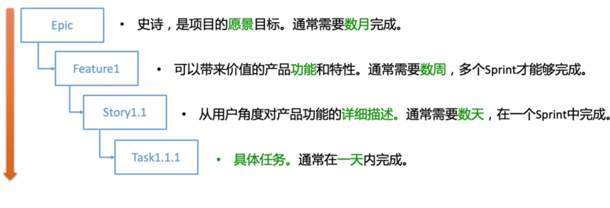
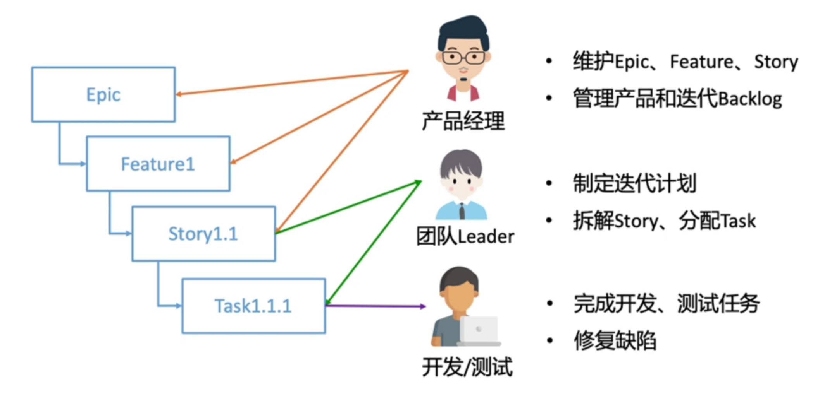

# scrum

<!-- @import "[TOC]" {cmd="toc" depthFrom=1 depthTo=6 orderedList=false} -->

<!-- code_chunk_output -->

- [scrum](#scrum)
    - [概述](#概述)
      - [1.scrum框架](#1scrum框架)
        - [(1) 角色](#1-角色)
        - [(2) 制品](#2-制品)
        - [(3) 活动](#3-活动)
      - [2.scrum规划](#2scrum规划)
        - [(1) 发布规划](#1-发布规划)
        - [(2) 迭代计划](#2-迭代计划)
      - [3.user story](#3user-story)
        - [(1) 定义](#1-定义)
      - [4.DevOps](#4devops)
        - [(1) 持续规划与设计](#1-持续规划与设计)
        - [(2) 持续开发与集成](#2-持续开发与集成)
        - [(3) 持续测试与反馈](#3-持续测试与反馈)
        - [(4) 持续部署与发布](#4-持续部署与发布)

<!-- /code_chunk_output -->

### 概述

#### 1.scrum框架

##### (1) 角色
* product owner
* scrum manager
* team

##### (2) 制品
* product backlog
    * 产品功能列表
* sprint backlog
    * 迭代开发任务列表
* working software
    * 可交付软件产品

##### (3) 活动
* sprint planning
* daily scrum meeting
* spring review
* sprint retrospective

#### 2.scrum规划

##### (1) 发布规划
* 定义user stories(用户故事)，并进行优先级划分
* 制定发布计划

##### (2) 迭代计划
* 确定迭代目标
* 选择user stories(用户故事)，并分解为多个任务
* 对故事和任务进行时间估算

#### 3.user story

##### (1) 定义
是从用户角度对功能的简要描述，story格式:
* `作为一个<角色>，可以<活动>，以便于<价值>`
    * 角色
        * 谁要使用这个功能
    * 活动
        * 需要执行什么操作
    * 价值
        * 完成操作后带来什么好处

#### 4.DevOps

##### (1) 持续规划与设计

##### (2) 持续开发与集成

##### (3) 持续测试与反馈
* 静态代码检测
* 测试内容
    * 功能测试
    * 接口测试 (是自动化测试的主要内容)
    * 性能测试

##### (4) 持续部署与发布