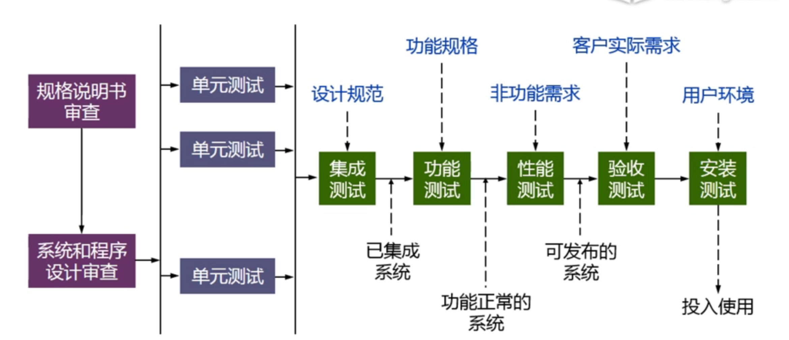
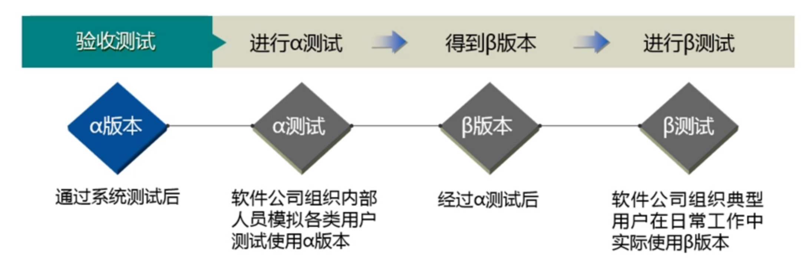

# testing

<!-- @import "[TOC]" {cmd="toc" depthFrom=1 depthTo=6 orderedList=false} -->

<!-- code_chunk_output -->

- [testing](#testing)
    - [概述](#概述)
      - [1.软件系统测试内容](#1软件系统测试内容)
        - [(1) unit testing (单元测试)](#1-unit-testing-单元测试)
        - [(2) integration testing (集成测试)](#2-integration-testing-集成测试)
        - [(3) system testing (系统测试)](#3-system-testing-系统测试)
        - [(4) acceptance testing (验收测试)](#4-acceptance-testing-验收测试)
        - [(5) installation testing (安装测试)](#5-installation-testing-安装测试)
      - [2.常用测试技术](#2常用测试技术)
        - [(1) black-box testing (黑盒测试)](#1-black-box-testing-黑盒测试)
        - [(2) white-box testing (白盒测试)](#2-white-box-testing-白盒测试)
        - [(3) smoke testing (冒烟测试)](#3-smoke-testing-冒烟测试)

<!-- /code_chunk_output -->

### 概述

#### 1.软件系统测试内容

##### (1) unit testing (单元测试)
* 对软件的基本单元进行测试 (模块或类)

##### (2) integration testing (集成测试)
* 将所有模块按要求组装成子系统或系统，进行测试
* 测试内容:
    * 测试模块间的接口，是否能够正常调用

##### (3) system testing (系统测试)
* functional testing (功能测试)
    * 从用户角度，进行功能验证
    * 测试内容:
        * 界面
        * 数据
        * 操作
        * 逻辑
        * API
* non-functional testing (非功能测试)
    * performance testing (性能测试)
        * 方式: 
            * 负载测试 
                * 在特定运行条件下 验证系统的能力状况
            * 压力测试
                * 发现在什么条件下应用程序的性能变得不可接受
        * 性能指标: 响应时间、容量和吞吐量、资源利用率

##### (4) acceptance testing (验收测试)
* 验证软件的功能和性能是否满足用户所期望的要求

##### (5) installation testing (安装测试)
验证软件系统是否能够在目标环境中成功安装

#### 2.常用测试技术

##### (1) black-box testing (黑盒测试)

* 功能测试

##### (2) white-box testing (白盒测试)

* 结构测试，对逻辑路径测试

##### (3) smoke testing (冒烟测试)

* 完成一个新版本的开发后，对该版本最基本的功能进行测试，保证基本的功能和流程能走通
