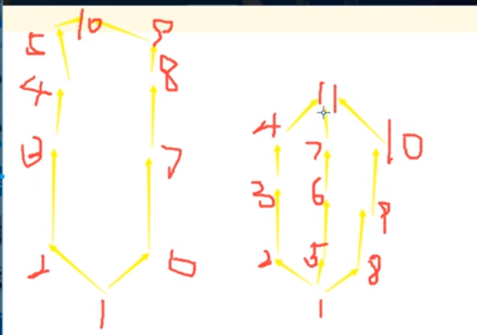

[toc]
# OOP(object oriented program)
**在python中一切皆对象**
### 类和对象的命名空间
#### 1.模型
```plantuml
Class A{
  static variables
  ---
  func(self)
  ---
  self.attributes
}
allowmixing
frame instance1{
  card "pointer" as p1
  card "attributes" as a1
  card "self" as s1
}
frame instance2{
  card "pointer" as p2
  card "attributes" as a2
  card "self" as s2
}
p1 -d->A
p2 -d->A
s1 -> instance1
s2 -> instance2
```
* 类有自己的一块内存空间
* 实例化时，对象开辟新的内存空间，并且用一个**类指针** **指向该对象的类**，用**self指针** **指向对象本身**
* 实例调用 属性和函数 时，先在自己的命名空间中寻找，找不到会去类的命名空间中寻找
* 所有实例**共用** **类命名空间中的函数**，只不过传入不同的参数
* 所有`self.xx = xx`的语句，都是在**具体对象的命名空间**中创建属性（由于python的缓存机制，可能指向同一块内存区域）

其他：
* 静态变量，需要用 **类名.xx** 调用和修改
* 没办法通过实例修改类中的内容，实例只能在自己的内存空间创建同名的属性，从而覆盖类中的属性

#### 2.利用静态变量计算有多少实例
```python
class A:
    count = 0
    def __init__(self):
        A.count += 1

a1 = A()
a2 = A()
print(a1.count)

#输出结果为：2
```

#### 3.在子类中调用父类的同名方法
```python
class A:
    def func1():
        pass

class B:
    def func1():
      super(A, self).func1()
```

### 基础
#### 1.定义一个类的基本格式
```python
class 类名:
  def __init__(self,参数):
    self.属性1=xx

  def func1(self):    
    print('%s' %self.属性1)

#类名采用大驼峰命名
#__init__是构造函数,在创建实例的时候自动调用
#所有方法的第一个参数必须是self,表示实例(可以用别的名字,java中是this)
#创建实例时,实例会自动作为第一个参数传入
```
#### 2.组合

**即将一个对象传入另一个对象中,就有了多级的对象**
```python
  class Weapon:
    def __init__(self,name,strength):
      self.name=name
      self.strength=100

  class GameRole:
    def __init__(self,name,weapon):
      self.name=name
      self.weapon=weapon

  ji=Weapon('方天画戟',100)
  lb=GameRole('吕布',ji)
  print(lb.weapon.name)   
#这里就有两级,输出的内容为"方天画戟"
```

#### 3.继承

**可以对父类的属性和方法进行重写**
```python
  class 类名(父类):
      pass
```

>重写构造函数:
```python
  def __init__(self,参数):
      super(类名, self).__init__(部分参数)
      #等价于: 父类.__init__(self,部分参数)
      #如果存在多重继承，用super函数，根据mro顺序找到，上一个类（不一定是父类）
          pass
```

>多重继承:   
```python
  class 类名(父类1,父类2):   
  #有相同的属性或方法时,优先继承左边父类的
      pass
```

#### 4.类的内置方法
##### （1）`__init__()`
初始化函数, 创建实例的时候，可以调用__init__方法做一些初始化的工作
如果子类重写了__init__，实例化子类时，则只会调用子类的__init__，此时如果想使用父类的__init__，可以再调用一下
```python
  def __init__(self,参数):
      父类.__init__(self,部分参数)
      #等价于:super(类名,self).__init__(部分参数)
          pass
```
##### （2）`__new__()`
构造函数，在`__init__`之前被调用
`__new__`方法是一个静态方法，第一参数是cls，`__new__`方法必须返回创建出来的实例

##### （3）`__del__()`
析构函数，释放对象时调用

##### （4）`__str__()`
当对象需要转换成字符串时,自动执行这个函数
```python
  def __str__(self):          
  #当对象需要转换成字符串时,自动执行这个函数
      return  'xx'
#如: a=A()
#print(a)，此时会返回xx
```

##### （5）`__call__()`
当对象执行调用时,自动执行这个函数
```python
  def __call__(self):    
  #当对象执行调用时,自动执行这个函数
      pass
#如: a=A()
#a()，此时会执行...处的代码
```

##### （6）`__getattribute__()`
在类 里面,其实并没有方法这个东西,**所有**的东西都保存在**属性**里面
所谓的调用方法其实是类里面的一个**同名属性**指向了一个**函数**,
**返回**的是**函数的地址**,再用 **函数()** 这种方式就可以调用它
```python
class Demo:
    def __getattribute__(self, item):
#item形参是实例调用方法或属性时，传入的属性名（不是必须用item，可以用其他名字代替）

        #如果调用的是test，则执行执行下面的内容，最后返回一个地址
        #如果不设置这个条件，不论调用什么都会执行
        if item == "test":  

            def test_func(arg1):
                print(item,arg1)

            #这里返回的是一个函数的地址
            return test_func      

demo = Demo()
demo.test       
#会获取__getattribute__返回的地址，
#由于返回的是函数的地址，而不是一个值的地址，
#所以demo.test不会输出任何内容，

demo.test("xxx")
#会执行test_func()这个函数
```
**注意**：再`__getattribute__`方法中，不要使用`self.xx`，因为每一次调用类的属性或方法，都会执行一次`__getattribute__`函数，可能有问题
#### 5.类的特殊属性和函数
* `_xx`
以单下划线开头，表示外部是可以访问的，但是，按照约定俗成的规定，当你看到这样的属性时，意思就是，“虽然我可以被访问，但是请把我视为私有属性，不要随意访问”。
* `__xx`   
两个下划线开头，声明该属性为私有，不能在类的外部被使用或直接访问，不能被子类继承
* `__xx__`
两个下划线开头和结尾，表示这个内置的属性或函数

#### 6.重载（overload）和重写（override，覆盖）
***
### 多继承
* python3中都是新式类（继承object的类都是新式类）
* 新式类遍历父类 使用的是 广度优先


***
### 抽象类
* 是一个开发的规范

#### 1.实现抽象类
* 方式一（常用）
```python
#A就是一个抽象类
class A:

  def func1():
    raise NotImplementedError("请在子类中重写该方法")
```
* 方式二
```python
from abc import ABCMeta.abstractmethod

class A(metaclass = ABCMeta):

  @abstractmethod
  def func1():
    pass
```
* 两种方式的区别
  * 方式一，如果没有重写func1方法，调用func1方法时才报错
  * 方式二，如果没有重写func1方法，实例化时就会报错

***

### 补充
#### 1.property装饰器
* 用来将方法伪装成属性（这个方法不能需要参数）
```python
class A:

  @peoperty
  def func1(self):
    pass

a = A()
a.func1     #像调用属性一样调用这个方法，其他没什么变化
```
