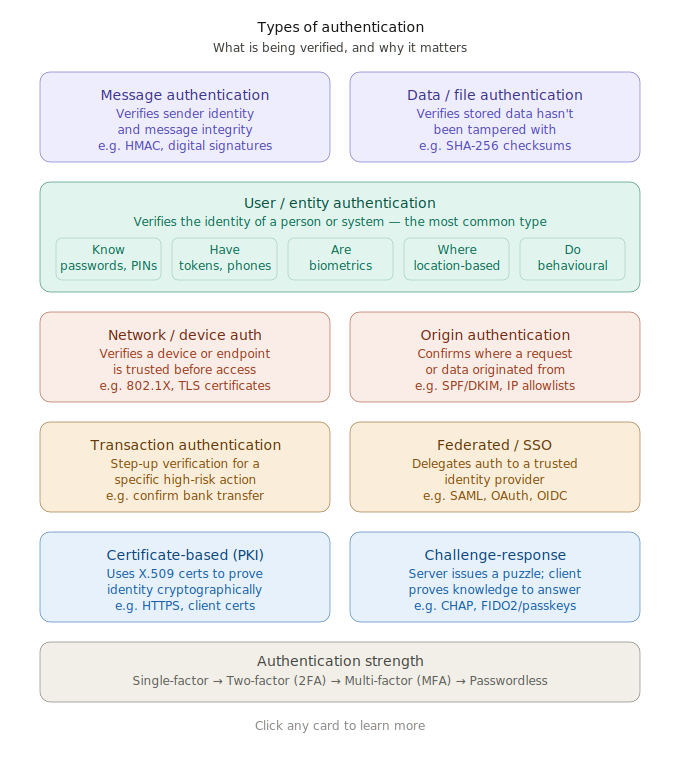

# Authentication

<!-- @import "[TOC]" {cmd="toc" depthFrom=1 depthTo=6 orderedList=false} -->

<!-- code_chunk_output -->

- [Authentication](#authentication)
    - [Overview](#overview)

<!-- /code_chunk_output -->

### Overview

