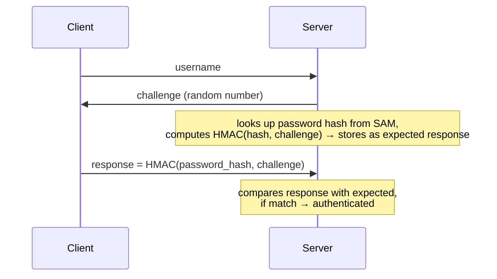

# Authentication

<!-- @import "[TOC]" {cmd="toc" depthFrom=1 depthTo=6 orderedList=false} -->
<!-- code_chunk_output -->

- [Authentication](#authentication)
    - [Overview](#overview)
      - [1. Challenge-Response Authentication](#1-challenge-response-authentication)
      - [2. NTLM (New Technology LAN Manager)](#2-ntlm-new-technology-lan-manager)
      - [3. Kerberos](#3-kerberos)

<!-- /code_chunk_output -->

### Overview

Challenge-response authentication is a family of protocols where the server sends a random value (challenge) and the client must prove knowledge of a secret by responding with a value derived from both the challenge and the secret — without ever sending the secret itself.

```
server → client: challenge (random)
client → server: response = f(secret, challenge)
server: verify by computing f(secret, challenge) independently
```

This prevents replay attacks — even if an attacker captures the response, it is only valid for that one challenge.

#### 1. Challenge-Response Authentication

Core idea: the server never receives the raw password. Instead:

1. Server sends a random **challenge**
2. Client computes **response = HMAC(password_hash, challenge)**
3. Server independently computes the same and compares

Because the challenge is random each time, the response is different on every login — capturing it is useless to an attacker.

#### 2. NTLM (New Technology LAN Manager)

Windows authentication protocol. Password hashes are stored in `C:\Windows\System32\config\SAM`.



**Weakness**: the password hash stored in SAM is effectively the password — if an attacker obtains the hash, they can compute valid responses without knowing the plaintext password (pass-the-hash attack).

#### 3. Kerberos

A network authentication protocol that uses a trusted third party (KDC) instead of the server verifying credentials directly.

**Three parties:**
- **Client** — the user or service requesting access
- **Server** — the resource being accessed
- **KDC (Key Distribution Center)** — trusted third party deployed on the domain controller, holds all password hashes

**Why Kerberos over NTLM:**
- Password hash never leaves the KDC — the server never sees it
- Tickets are time-limited, reducing replay attack windows
- Supports mutual authentication — client also verifies the server's identity
- More complex than certificate-based auth, but widely used in enterprise Windows environments
