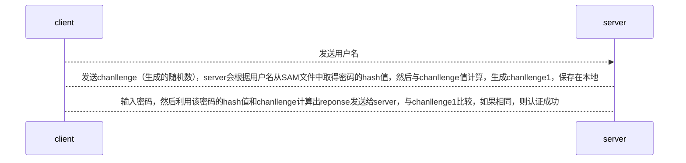

# 认证

### 概述

#### 1.NTLM认证（new technology lan manager，winodws操作系统用户登录）
密码经过hash后存储在：c:/windows/system32/config/SAM文件中

#### 2.域认证体系——kerbroes
（1）kerberos是一种网络认证协议，需要第三方服务
（2）域认证所参与的三个角色：
  * client
  * server
  * KDC（key distribution center，密钥分发中心，部署在域控制器上）
> KDC就是第三方服务，用于保证client和server端安全通信  
> 比证书认证更加复杂  
