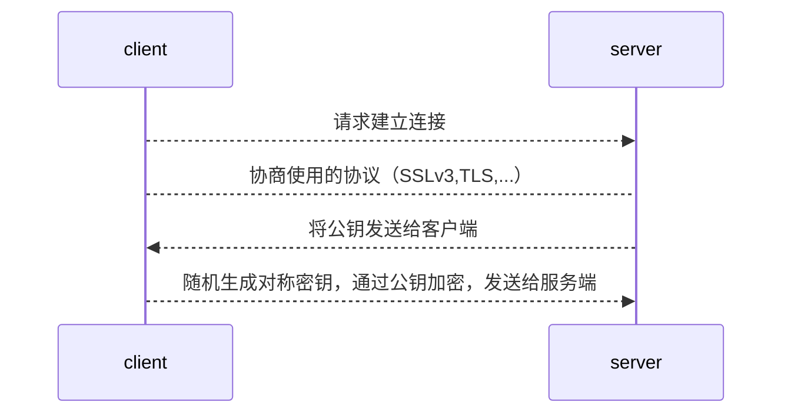
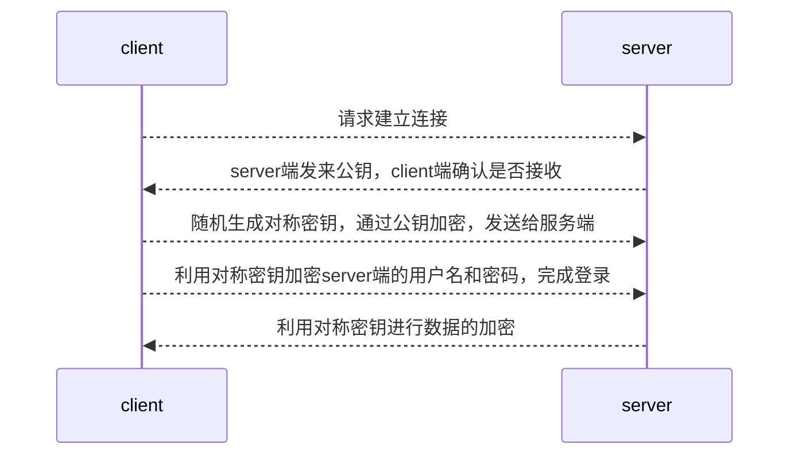

[toc]
### 基础
#### 1.第三方机构（Certificate Authority）
是为了非对称加密设置的，确保所有人能够获得彼此正确的公钥
ca机构 **本身拥有公钥和私钥**，ca机构的作用如下：

##### （1）认证（即进行数字签名）
* 用 私钥 给别人的公钥的特征码进行加密
* 其他人可以用ca机构的公钥解密该公钥
* 从而保证了完整性（即该公钥没有问题）和身份验证（即该公钥是经过ca认证的）

##### （2）数字证书
经过ca机构认证的公钥
数字证书的格式为x509

##### （3）ca证书（格式为x509）
ca机构自签署证书，即ca机构使用自己的私钥给自己的公钥进行签名
CA根证书被内置在浏览器中

##### （4）维护CRL（certificate revocation list，证书吊销列表）
当某个人的密钥丢了，则其公钥就不可信了，就应该放入CRL中

##### （5）CSR请求（certificate signature request）
ca机构根据CSR请求对相应公钥进行签名

#### 2.SSL和TLS区别：
是两种协议，都是在应用层和传输层之间的，用于给数据加密
* SSL是一个公司发布的标准
* TLS是国际组织发布的标准

#### 3.命名规范
* 私钥的后缀一般为：`.key`
* 公钥的后缀一般为：`.pub`
* 证书的后缀一般为：`.crt`
* ca证书的一般名为：`ca.crt`
* 请求的后缀一般为：`.csr`
* 经过base64 encode后的密钥：`.pem`

#### 5.x509 v3证书可以支持多个域名
SAN：Subject Alternative Name
SAN 是 SSL 标准 x509 中定义的一个扩展。使用了 SAN 字段的 SSL 证书，可以扩展此证书支持的域名，使得一个证书可以支持多个不同域名的解析

***

### openssl

**配置文件：/etc/pki/tls/openssl.cnf**
#### 1.openssl实现私有ca

（1）生成私钥
```shell
(umask 077;openssl genrsa -out <CA.KEY>)     #括号里的命令是在子进程中执行的

#公钥是从私钥中提取出来的，因为ca需要的是自签署证书，所以这里不需要这样提取
#openssl rsa -in xx -pubout -out xx
```
（2）生成自签署证书（即ca，数字证书的格式为x509）
```shell
openssl req -new -x509 -key <CA.KEY> -out <CA.CRT> -days 3650
```
#### 2.openssl利用已有ca，生成数字证书（即对其他公钥进行签名）

（1）生成证书签名请求（利用私钥生成该请求，因为公钥是从私钥中提取出来的）
```shell
openssl req -new -key <SERVER.KEY> -out <SERVER.CSR> -subj '/CN=xx'

#CN很重要！！！！
#CN（Common Name）一定要匹配访问的域名（比如：要my1.local.com和my2.local.com，CN就可以写为*.local.com）
```
（2）签署证书请求文件，生成数字证书
```shell
openssl x509 -req -in <SERVER.CSR> \      #-req -in 后面跟请求文件
        -CA <CA.CRT> -CAkey <CA.KEY> \
        -CAcreateserial \       #当序列号文件不存在则自动创建，如果在openssl的配置的目录下找不到serial文件，该命令就会报错
        -days 3650 -out <SERVER.CRT>
```
#### 3.查看证书内容
```shell
openssl x509 -in <cert> -text
openssl rsa -in <key> -text
```

#### 4.创建x509 v3证书（支持多个域名）
* 创建一个文件 v3.ext（名字随便取）
```shell
authorityKeyIdentifier=keyid,issuer
basicConstraints=CA:FALSE
keyUsage = digitalSignature, nonRepudiation, keyEncipherment, dataEncipherment
subjectAltName=DNS:hostname1, DNS:hostname2
```

* 签署证书 时，需要加一个选项
```shell
openssl x509 -req -in <SERVER.CSR> \
        -CA <CA.CRT> -CAkey <CA.KEY> \
        -CAcreateserial \
        -days 3650 -out <SERVER.CRT> \
        -extfile v3.ext       #需要增加这个选项
```

***

### jks（java keystore）

#### 1.有两个密钥库

|keystore|truststore|
|-|-|
|用于存储自己的证书（私钥、公钥）|用于存储信任的证书（一般存放ca证书），或者其他证书（比如客户端的一个的证书是没有经过新的ca签署的，则服务端需要把这个证书放入到truststore中，才会信任这个证书）|

#### 2.创建jks

* 创建ca证书
```shell
(umask 077;openssl genrsa -out ca.key)
openssl req -new -x509 -key ca.key -out ca.crt -days 3650
```

* 创建服务端证书并用ca签署
```shell
(umask 077;openssl genrsa -out server.key)  
openssl req -new -key server.key -out server.csr -subj '/CN=xx'
openssl x509 -req -in server.csr -CA ca.crt -CAkey ca.key  -CAcreateserial -days 3650 -out server.crt
```

* 创建keystore
```shell
keytool -keystore KeyStore.jks -alias localhost -validity 3650 -genkey -keyalg RSA
```

* 导入私有证书
```shell
openssl pkcs12 -export -in server.crt -inkey server.key -out server.p12

keytool -importkeystore -srckeystore server.p12 -srcstoretype PKCS12 -destkeystore server.jks -deststoretype JKS  -srcalias 1 -destalias localhost
```

* 导入信任的证书（比如ca证书）
```shell
keytool -importcert -file ca.crt -keystore truststore.jks -alias "caroot"
```

#### 3.查看jks中的证书
```shell
keytool -v -list -keystore <keystore>
```

#### 4.生成jks的脚本
[脚本地址](https://raw.githubusercontent.com/confluentinc/confluent-platform-security-tools/master/kafka-generate-ssl.sh)

#### 5.从jks中提取pem格式证书的脚本
* 提取出来的证书没有密码
```shell
#!/bin/bash
keyStore="kafka.keystore.jks"
password="123456"
alias="caroot"
outputFolder="./"

echo $keyStore
echo "Generating certificate.pem"
keytool -exportcert -alias $alias -keystore $keyStore -rfc -file $outputFolder/certificate.pem -storepass $password

echo "Generating key.pem"
keytool -v -importkeystore -srckeystore $keyStore -srcalias $alias -destkeystore $outputFolder/cert_and_key.p12 -deststoretype PKCS12 -storepass $password -srcstorepass $password
openssl pkcs12 -in $outputFolder/cert_and_key.p12 -nodes -nocerts -out $outputFolder/key.pem -passin pass:$password

echo "Generating CARoot.pem"
keytool -exportcert -alias $alias -keystore $keyStore -rfc -file $outputFolder/CARoot.pem -storepass $passwor
```

***

### pkcs12

#### 1.概述

#### 2.使用
* 创建ca证书
```shell
(umask 077;openssl genrsa -out ca.key)
openssl req -new -x509 -key ca.key -out ca.crt -days 3650
```

* 创建服务端证书并用ca签署
```shell
(umask 077;openssl genrsa -out server.key)  
openssl req -new -key server.key -out server.csr -subj '/CN=xx'
openssl x509 -req -in server.csr -CA ca.crt -CAkey ca.key  -CAcreateserial -days 3650 -out server.crt
```

* 创建keystore
```shell
openssl pkcs12 -export -in server.crt -inkey server.key -out KeyStore.p12
```

#### 3.查看pkcs12证书信息
```shell
openssl pkcs12 -info -in xx.p12
```

***

### 应用

#### 1.https建立连接的过程

#### 2.ssh建立连接过程

