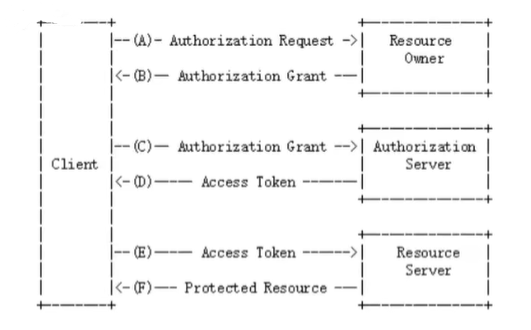

# OAuth2.0

<!-- @import "[TOC]" {cmd="toc" depthFrom=1 depthTo=6 orderedList=false} -->

<!-- code_chunk_output -->

- [OAuth2.0](#oauth20)
    - [Overview](#overview)
      - [1.OAtuh2.0](#1oatuh20)
      - [2.Concepts](#2concepts)
      - [3.OAuth2.0 process](#3oauth20-process)
      - [4.grant types](#4grant-types)
        - [(1) authorization_code](#1-authorization_code)
        - [(2) client_credentials](#2-client_credentials)
        - [(3) refresh_token](#3-refresh_token)

<!-- /code_chunk_output -->

### Overview

#### 1.OAtuh2.0
是一种授权协议

#### 2.Concepts

|概念|说明|通过微信登录百度的场景|
|-|-|-|
|Authrization server|授权服务|
|Resource server|资源服务|
|UserDetails、ResourceOwner|用户|微信号|
|ClientDetails、Client|客户端（即应用，不是所有客户端都能去授权服务申请授权，只有在授权服务中注册的客户端才能去申请授权）|百度在微信中的唯一索引（百度在微信中注册的），这样微信才能知道是百度来申请授权了|
|authenticate_code|临时授权码|
|access_toke|访问令牌|
|scope|权限范围|比如只有获取微信用户信息的权限，没有获取微信朋友圈的权限|
|redirect_uri|授权服务，将应用重定向到这个地址，并传递认证信息等到这个地址|

#### 3.OAuth2.0 process

* client向 资源所有者 申请授权
  * 资源所有者进行授权
* client向 授权服务 申请令牌
  * 授权服务返回令牌
* client用令牌向 资源服务 申请受保护的资源
  * 资源服务返回受保护的资源

#### 4.grant types

##### (1) authorization_code
* 临时授权码的作用：
  * 让用户知道该client从授权服务请求了哪些信息 并且 让用户进行确认，
  * 如果用户确认了，授权码会返回client，client可以利用该授权码获取token
  * 如果用户拒绝了，则授权码不会返回给client
* 所以授权码是一次性的

* 1: 用户 访问应用
* 2：应用 将用户重定向到 授权服务，让用户输入认证信息
* 3: 授权服务 收到用户认证信息
* 4: 授权服务 发送 授权码 给应用
* 5：应用 用授权码向授权服务申请token
* 6: 授权服务 给 应用 发放token

##### (2) client_credentials

* 不需要用户的参与

##### (3) refresh_token
* 当认证成功后，refresh_token会伴随着access_token一起返回
* 当access_token快过期时，利用refresh_token申请新的token
