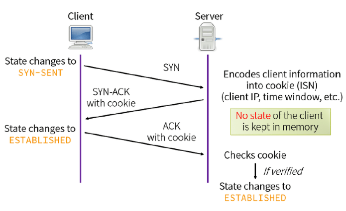

# DDoS

<!-- @import "[TOC]" {cmd="toc" depthFrom=1 depthTo=6 orderedList=false} -->
<!-- code_chunk_output -->

- [DDoS](#ddos)
    - [Introduction](#introduction)
      - [1.what is DDoS attack](#1what-is-ddos-attack)
      - [2.principle](#2principle)
      - [3. 3 typpes of DDoS attacks](#3-3-typpes-of-ddos-attacks)
        - [(1) application layer attacks](#1-application-layer-attacks)
        - [(2) protocol attacks](#2-protocol-attacks)
        - [(3) volumetric attacks](#3-volumetric-attacks)
      - [4.如何识别DDoS攻击](#4如何识别ddos攻击)
      - [5.mitigate DDoS attack](#5mitigate-ddos-attack)
        - [(1) blackhole routing](#1-blackhole-routing)
        - [(2) rate limiting](#2-rate-limiting)
        - [(3) web application firewall](#3-web-application-firewall)
        - [(4) anycast network diffusion](#4-anycast-network-diffusion)
        - [(5) SYN cookies](#5-syn-cookies)

<!-- /code_chunk_output -->

### Introduction

#### 1.what is DDoS attack
distributed denial-of-service attack
* 通过大量的请求服务器，耗尽服务器的资源，导致服务器无法响应正常用户的请器

#### 2.principle
* 首先需要建立botnet
  * 需要向很多主机注入恶意程序，然后就可以控制这些主机
* 利用botnet，操作botnet中的机器，同时攻击某一目标

#### 3. 3 typpes of DDoS attacks

##### (1) application layer attacks
* 利用7层协议，请求的数据量比较小，服务需要返回的数据量比较大
* 比如: HTTP flood（botnet同时向某一目标发起http请求）

##### (2) protocol attacks
* 利用3层或4层协议的弱点
* 比如：SYN flood
  * In the case of a SYN-ACK packet, B will reply with a RST (reset) packet, telling the server that no connection was initiated.

##### (3) volumetric attacks
* 需要利用ip spoofing技术
* botnet用受害者的ip作为源ip，访问某一个服务器（该服务器会返回大量的数据），然后该服务器会将数据返回给受害者
* 比如：DNS amplification（DNS放大攻击）

#### 4.如何识别DDoS攻击
常见的一些特征：
* 来自某一个ip或网段的可疑流量
  * 比较某一个ip的流量非常大，就比较可疑
* 对某一个网页或者一个endpoint的访问量激增
* 某一时间点或每隔一个时间段，流量就激增
* 大量的流量使用相同的行为配置（比如：设备类型、浏览器版本等等）

#### 5.mitigate DDoS attack

##### (1) blackhole routing
添加blackhole路由，将部分流量丢弃
* 这是一种通用手法，能够缓解DDoS攻击，但是容易丢掉合法的流量
* 但是对于一个大型网络中的某一个节点被攻击，丢弃这个节点的流量，能够保护整个网络

##### (2) rate limiting

##### (3) web application firewall

##### (4) anycast network diffusion

##### (5) SYN cookies
The advantage of SYN cookies is that the server doesn’t have to create and **store a TCB** upon reception of the SYN segment.
