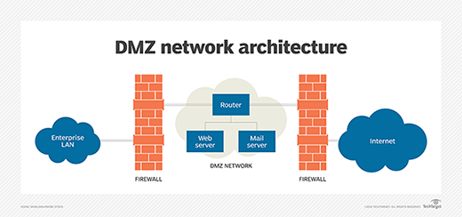

# overview

<!-- @import "[TOC]" {cmd="toc" depthFrom=1 depthTo=6 orderedList=false} -->
<!-- code_chunk_output -->

- [overview](#overview)
    - [概述](#概述)
      - [1.DMZ（demilitarized zone，隔离区，非军事化区）](#1dmzdemilitarized-zone隔离区非军事化区)

<!-- /code_chunk_output -->

### 概述

#### 1.DMZ（demilitarized zone，隔离区，非军事化区）
* 非安全系统与安全系统之间的缓冲区（即将两个系统隔离）
* 位于企业内部网络和外部网络之间的小网络区域内
  * 在这个小网络区域内可以放置一些必须公开的服务器设施
    * 如企业Web服务器、FTP服务器和论坛等
  * 有效地保护了内部网络

