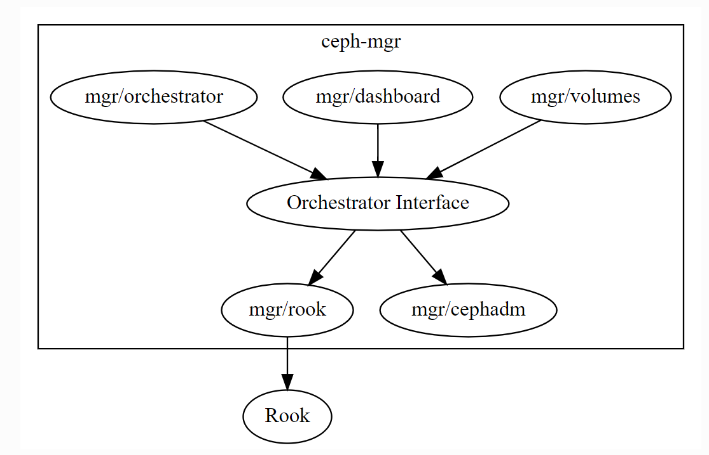

# 部署ceph

<!-- @import "[TOC]" {cmd="toc" depthFrom=1 depthTo=6 orderedList=false} -->
<!-- code_chunk_output -->

- [部署ceph](#部署ceph)
    - [概述](#概述)
      - [1.最小资源](#1最小资源)
      - [2.部署建议](#2部署建议)
      - [3.orchestrator](#3orchestrator)
      - [4.基础概念](#4基础概念)
      - [5.orchestrator管理service](#5orchestrator管理service)
    - [安装步骤](#安装步骤)
      - [1.安装前准备](#1安装前准备)
        - [（1）选择操作系统](#1选择操作系统)
        - [（2）时间同步（非常重要，需要安装，不然后面会报错）](#2时间同步非常重要需要安装不然后面会报错)
        - [（3）设置主机名（必须要设置好）](#3设置主机名必须要设置好)
        - [（4）防火墙关闭](#4防火墙关闭)
        - [（5）安装依赖软件](#5安装依赖软件)
      - [2.修改docker配置](#2修改docker配置)
      - [3.设置相关服务开启自启](#3设置相关服务开启自启)
      - [4.初始化第一个节点](#4初始化第一个节点)
        - [（1）下载cephadm](#1下载cephadm)
        - [（2）安装客户端工具](#2安装客户端工具)
        - [（3）提前准备好镜像](#3提前准备好镜像)
        - [（4）初始化集群](#4初始化集群)
      - [4.将其他节点orchestrator](#4将其他节点orchestrator)
      - [5.添加osd](#5添加osd)
        - [（1）通过yaml文件并实现data、WAL、DB分离](#1通过yaml文件并实现data-wal-db分离)
      - [6.删除某个osd](#6删除某个osd)
        - [(1) 通用方法](#1-通用方法)
        - [(2) ceph orch方法](#2-ceph-orch方法)
    - [开启ceph-exporter](#开启ceph-exporter)
      - [1.enable prometheus mgr module](#1enable-prometheus-mgr-module)

<!-- /code_chunk_output -->

### 概述

#### 1.最小资源
[参考](https://docs.ceph.com/en/pacific/start/hardware-recommendations/)

|组件（per daemon）|CPU|RAM|STORAGE|
|-|-|-|-|
|OSD|1|4G+|根据存储需求|
|MON|2|2-4G|60G|
|MDS|2|2G|忽略|

#### 2.部署建议
* osd节点上应该预留20%内存，防止出现峰值
* 一个磁盘驱动，只应该跑一个OSD
* OSD应该尽可能分散在多台机器上
* 如果一台机器上跑多个OSD（建议不超过8个）
  * 需要确保操作系统能支持这种情况
  * 总的OSD驱动吞吐量不应该超过网络带宽
* 万兆网卡(10GbE+)

#### 3.orchestrator
[参考](https://docs.ceph.com/en/latest/mgr/orchestrator/)
是ceph-mgr的一个模块，负责对ceph的服务进行编排，
* 将主机加入到ceph集群中，orchestrator就能发现主机上的设备，从而自动部署相关服务到该主机上（比如自动部署mon、mds、osd等）
* orchestrator也会利用外部的项目Rook


#### 4.基础概念
* service type
服务类型（`mon|mgr|rbd-mirror|crash|alertmanager|grafana|node-exporter|prometheus`），一个服务类型有多个service
* service
具体的服务，比如osd这个服务类型下，有osd.all-available-devices等服务，
一个服务可能多个daemon（即进程）
* daemon
即进程
* placement
placement指定需要部署的数量、部署到哪些机器上等，即orchestrator会将服务编排到这些主机上

* unmanaged
当服务被设置unmanaged，表示该服务不受orchestrator管理（即不会自动编排）

#### 5.orchestrator管理service
通过声明式api管理
```shell
ceph orch ls --export
```
```yaml
#指定服务类型
service_type: mon
#指定服务
service_name: mon
#选择需要部署的数量，部署在哪些主机上
placement:
  count: 3
  host_pattern: "mon*"
---
service_type: mgr
service_name: mgr
placement:
  host_pattern: "mgr*"
---
service_type: osd
service_name: osd
service_id: default_drive_group
placement:
  host_pattern: "osd*"
data_devices:
  all: true
```
```shell
#部署或者更新service
ceph orch apply -i xx.yaml

#查看错误信息
ceph orch ls <service_type> <service_name> -f yaml

#删除service
ceph orch rm <sevice_name>
```

***

### 安装步骤

#### 1.安装前准备

##### （1）选择操作系统
[参考](https://docs.ceph.com/en/quincy/start/os-recommendations/)

##### （2）时间同步（非常重要，需要安装，不然后面会报错）

##### （3）设置主机名（必须要设置好）
* 主机名之后要保证不变，如果变化了
* 主机名必须能够反向解析
  * 所以在hosts文件中，一个ip最好只对应一个host
  * 否则，反向解析成其他主机名
```shell
/etc/hostname
/etc/hosts
```
##### （4）防火墙关闭

##### （5）安装依赖软件
* python3
* docker-ce

#### 2.修改docker配置
* 如果是私有仓库需要配置好证书或者insecure仓库
```shell
{
  "exec-opts": ["native.cgroupdriver=systemd"],
  "log-driver": "json-file",
  "log-opts": {
    "max-size": "50m",
    "max-file": "3"
  }
}
```

#### 3.设置相关服务开启自启
```shell
systemctl restart docker
systemctl enable docker
```

#### 4.初始化第一个节点

##### （1）下载cephadm
[参考](https://docs.ceph.com/en/pacific/cephadm/install/#curl-based-installation)

##### （2）安装客户端工具
* 添加镜像源
镜像源中包含ceph相关服务、ceph客户端、cephadm等包

```shell
./cephadm add-repo --release octopus    #这里添加的是octopus发行版的镜像源
```

* 安装客户端软件（建议安装）
```shell
#利用仓库源安装cephadm，可以直接使用cephadm命令：cephadm -h
./cephadm install   
 #利用仓库源安装ceph客户端，可以使用ceph命令：ceph -h
yum -y install ceph-common
#也可以通过cephadm使用ceph命令，原理是进启动了一个临时容器执行ceph命令
cephadm shell -- ceph -h
```

##### （3）提前准备好镜像
```shell
#查看需要的镜像
$ whereis cephadm
$ vim /usr/sbin/cephadm

DEFAULT_IMAGE = 'quay.io/ceph/ceph:v15'
DEFAULT_PROMETHEUS_IMAGE = 'quay.io/prometheus/prometheus:v2.18.1'
...
```

##### （4）初始化集群
```shell
cephadm -v bootstrap \
        --registry-url harbor.test.com --registry-username admin --registry-password Harbor12345 \
        --skip-monitoring-stack \
        --mon-ip <IP>   

#--skip-monitoring-stack  不安装prometheus, grafana, alertmanager, node-exporter
```
做了以下的操作：
* 安装chronyd服务
* 启动monitor和manager服务
* 生成ssh密钥对，公钥：`/etc/ceph/ceph.pub`，并会添加到`/root/.ssh/authorized_keys`中，私钥存放在monitor服务中
* 生成admin账号的密钥：`/etc/ceph/ceph.client.admin.keyring`
* 生成配置文件：`/etc/ceph/ceph.conf`
* 给该机器打上`_admin`标签（有这个标签的机器，都会拷贝`/etc/ceph/ceph.conf`和`/etc/ceph/ceph.client.admin.keyring`这两个文件）

#### 4.将其他节点orchestrator
```shell
#将公钥拷贝到需要加入的机器
ssh-copy-id -f -i /etc/ceph/ceph.pub root@<HOST>

#将机器加入orchestartor，就能发现设备并自动编排ceph的服务
ceph orch host add <newhost> --labels _admin  #打上_admin标签，不打也行，主要是为了在其他节点上也能够使用ceph命令，因为ceph需要依赖`/etc/ceph/ceph.conf`和`/etc/ceph/ceph.client.admin.keyring`这两个文件
```

#### 5.添加osd
```shell
#查看通过orchestrator自动发现的磁盘
ceph orch device ls

#方式一：
#利用osd服务类型的all-available-devices这个服务：
#osd.all-available-devices会自动在可用的磁盘上启动osd
ceph orch apply osd --all-available-devices

#方式二：
#表示orchestrator不再管理osd服务类型的all-available-devices这个服务（即不会自动编排）
#需要手动添加osd
ceph orch apply osd --all-available-devices --unmanaged=true
#查看是否设置成功：ceph orch ls osd
#手动添加osd
ceph orch daemon add osd <HOST>:<DEVICE_PATH>
```

##### （1）通过yaml文件并实现data、WAL、DB分离
* yaml文件
```yaml
service_type: osd
service_id: <service_naem>
placement:
  hosts:
  - <hostname>

#指定数据盘
#db和wal若使用磁盘，则会将磁盘按数据盘的数量进行均分
#db和wal若使用lvm，则lvm的数量必须和这里磁盘的数量相等
#   lvm必须提前划分好，lvm的路径必须使用这种（而不是/dev/mapper/): /dev/<vg>/<lv>
data_devices:

  paths:
  - /dev/vdb
  - /dev/vdd
db_devices:
  paths:
  - /dev/ceph-db/1
  - /dev/ceph-db/2
wal_devices:
  paths:
  - /dev/ceph-wal/1
  - /dev/ceph-wal/2
```
* 部署
```shell
ceph orch apply -i <file>
```

#### 6.删除某个osd

##### (1) 通用方法

* 将osd踢出集群
```shell
ceph osd out <osd_id>
```

* 确保数据已经安全转移，再进行下面得步骤
  * 等所有pg都处于`active+clean`状态（ceph status查看）
  * 使用下面命令检查数据是否转移：
  ```shell
  ceph osd safe-to-destroy <ids>
  ```

* 删除配置文件中关于该osd的配置：`ceph.conf`

* 删除osd
```shell
#需要都执行一下
ceph osd crush remove  <osd_id> #或：osd.<osd_id>
ceph auth del <osd_id> #或：osd.<osd_id>
ceph osd rm <osd_id>
```

* 如果未删干净，请执行
```shell
#删除该osd的crush
ceph osd crush remove <osd_id>
#删除该osd的key
ceph osd del <osd_id>
```

##### (2) ceph orch方法
```shell
#停止相关服务，防止重新拉起来
ceph orch stop <service_name>

#删除osd
ceph orch osd rm <osd_id>
#查看删除状态
ceph orch osd rm status

#删除相关daemon
ceph orch daemon rm <daemon_name> --force

#删除服务
ceph orch rm <service_name>

#删除磁盘
ceph orch device zap <hostname> <path>
```

***

### 开启ceph-exporter

[参考](https://docs.ceph.com/en/quincy/mgr/prometheus/)

#### 1.enable prometheus mgr module
```shell
ceph mgr module enable prometheus
```

* 查看
```shell
ceph mgr services
```
