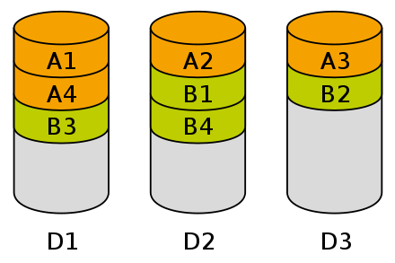

# overview

<!-- @import "[TOC]" {cmd="toc" depthFrom=1 depthTo=6 orderedList=false} -->
<!-- code_chunk_output -->

- [overview](#overview)
    - [概述](#概述)
      - [1.常用的三种存储形式](#1常用的三种存储形式)
        - [（1）block storage（块存储）](#1block-storage块存储)
        - [（2）file storage（文件存储）](#2file-storage文件存储)
        - [（3）object storage（对象存储）](#3object-storage对象存储)
      - [2.data striping（数据条带化）](#2data-striping数据条带化)
      - [3.why object storage：scalability](#3why-object-storagescalability)
        - [（1）传统的基于block的文件系统](#1传统的基于block的文件系统)
        - [（2）横向扩展（scale-out）的文件系统（比如：hdfs）](#2横向扩展scale-out的文件系统比如hdfs)
        - [（3）object storage](#3object-storage)
    - [object storage](#object-storage)
      - [1.概述](#1概述)
        - [（1）object](#1object)
        - [（2）bucket](#2bucket)

<!-- /code_chunk_output -->

### 概述

#### 1.常用的三种存储形式

##### （1）block storage（块存储）
通过 大小相同的block 组织数据，通过block id索引数据
* 可以跨多种环境存储数据（比如：linux、windows等）

##### （2）file storage（文件存储）
通过 层级结构 组织数据，通过file id（server name + directory path + filename）索引数据
* 无法在多个文件服务器之间分散工作负载

##### （3）object storage（对象存储）
通过 key-value方式 组织数据，通过key索引数据
metadata用于描述该对象

* 对象不能被修改

#### 2.data striping（数据条带化）
将 **一块连续的数据** **分成**很多小部分，并把他们分别存储到**不同的磁盘**上，这样读取该数据时，就能**同时**读取多个磁盘，从而提升IO性能

#### 3.why object storage：scalability

##### （1）传统的基于block的文件系统
当数据量增加，传统的基于block的文件系统，需要维护的inode数量急剧增加，导致性能下降

##### （2）横向扩展（scale-out）的文件系统（比如：hdfs）
将负载分发到多个文件系统，解决了inode急剧增加带来的性能问题
缺点：
* hdfs复杂且劳动密集
* 如果要实现高可用，需要利用副本（则当有3个副本时，就会有200%的磁盘被浪费，用于备份）

##### （3）object storage
* 利用erasure coding技术实现了高可用，减少了磁盘的浪费
* 按对象存储，不需要维护大量的inode

***

### object storage

#### 1.概述

##### （1）object
对象

##### （2）bucket
* 所有object都必须术语某个bucket
* bucket通常也是计费、权限控制、生命周期等高级功能的管理实体
* 一般，公有云厂商会确保bucket名称在全球地域服务具有唯一性，且不能修改
